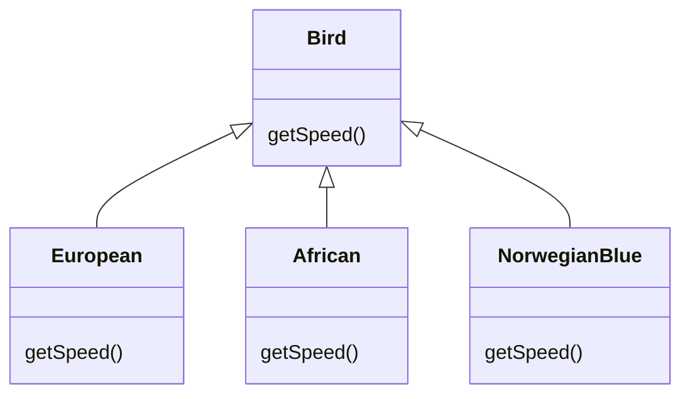
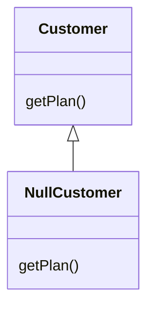

# 重构的方法

<show-structure for="chapter,procedure" depth="2"/>

## 重新组织函数

###  1. 提炼函数(Extract Method)

将代码放进一个独立函数中，并让函数名称解释该函数的用途。

动机：

+ 每个函数粒度都很小，那么被复用的机会就会更大
+ 使高层函数读起来像注释
+ 函数的覆写会更容易

做法:
 
+ 创建一个新函数，根据函数的意图来命名（做什么而不是怎么做）
+ 将提炼出来的代码从源函数复制到新函数
+ 仔细检查提炼的代码，看是否引用了“作用域限于源函数”的变量（包括局部变量和额和源函数参数）
+ 检查是否有“仅用于被提炼代码”的临时变量。如果有，在目标函数中声明为临时变量。
+ 检查被提炼的代码，看看是否有任何局部变量的值被更改，如果一个临时变量的值被更改了，看看是否可以将被提炼的代码处理为一个查询，并将结果赋值给相关变量。如果很难或者如果修改的临时变量不止一个，可能需要先使用*Split Temporary Variable*,然后再尝试提炼。也可使用*Replace Temp with Query* 来消灭临时变量
+ 将提炼代码中需要读取的临时变量，当作参数传给目标函数
+ 处理完所有局部变量之后，进行编译
+ 在源函数中，将被提炼的代码替换为对目标函数的调用
+ 编译，测试

###  2. 内联函数(Inline Method)

一个函数的本体与名称同样清楚易懂。

在函数调用点插入函数本体，然后移除该函数。

做法：
+ 检查函数，确定不具备多态性
+ 找出这个函数的所有调用点
+ 将这个函数的所有调用点都替换为函数本体
+ 编译测试
+ 删除改函数的定义

###  3. 内联临时变量(Inline Temp)

一个临时变量，只被简单表达式赋值一次，而它妨碍了其它重构手法。

将所有对该变量的引用动作，替换为对它赋值的那个表达式自身。
<compare id="inline-temp-compare">

```java
double basePrice = anOrder.basePrice();
return basePrice > 1000;
```

```java
return anOrder.basePrice() > 1000;
```
</compare>

###  4. 以查询取代临时变量(Replace Temp with Query)

以临时变量保存某一表达式的运算结果，将这个表达式提炼到一个独立函数中，将所有对临时变量的引用点替换为对新函数的调用。

Replace Temp with Query 往往是 Extract Method 之前必不可少的一个步骤，因为局部变量会使代码难以提炼。

```java
double basePrice = quantity * itemPrice;
if (basePrice > 1000)
    return basePrice * 0.95;
else
    return basePrice * 0.98;
if (basePrice() > 1000)
    return basePrice() * 0.95;
else
    return basePrice() * 0.98;

// ...
double basePrice(){
    return quantity * itemPrice;
}
```

###  5. 引起解释变量(Introduce Explaining Variable)


将复杂表达式(或其中一部分)的结果放进一个临时变量， 以此变量名称来解释表达式用途。

```java
if ((platform.toUpperCase().indexOf("MAC") > -1) &&
  (browser.toUpperCase().indexOf("IE") > -1) &&
  wasInitialized() && resize > 0) {
    // do something
}
final boolean isMacOS = platform.toUpperCase().indexOf("MAC") > -1;
final boolean isIEBrower = browser.toUpperCase().indexOf("IE") > -1;
final boolean wasResized = resize > 0;

if (isMacOS && isIEBrower && wasInitialized() && wasResized) {
    // do something
}
```

###  6. 分解临时变量(Split Temporary Variable)


某个临时变量被赋值超过一次，它既不是循环变量，也不是用于收集计算结果。

针对每次赋值，创造一个独立、对应的临时变量，每个临时变量只承担一个责任。

###  7. 移除对参数的赋值(Remove Assigments to Parameters)

以一个临时变量取代对该参数的赋值。

```java
int discount (int inputVal, int quentity, int yearToDate) {
    if (inputVal > 50) inputVal -= 2;
    ...
}
int discount (int inputVal, int quentity, int yearToDate) {
    int result = inputVal;
    if (inputVal > 50) result -= 2;
    ...
}
```

###  8. 以函数对象取代函数(Replace Method with Method Object)


当对一个大型函数采用 Extract Method 时，由于包含了局部变量使得很难进行该操作。

将这个函数放进一个单独对象中，如此一来局部变量就成了对象内的字段。然后可以在同一个对象中将这个大型函数分解为多个小型函数。

###  9. 替换算法(Subsititute Algorithn)


##  在对象之间搬移特性

###  1. 搬移函数(Move Method)


类中的某个函数与另一个类进行更多交流: 调用后者或者被后者调用。

将这个函数搬移到另一个类中。

###  2. 搬移字段(Move Field)


类中的某个字段被另一个类更多地用到，这里的用到是指调用取值设值函数，应当把该字段移到另一个类中。

###  3. 提炼类(Extract Class)

某个类做了应当由两个类做的事。

应当建立一个新类，将相关的字段和函数从旧类搬移到新类。

###  4. 将类内联化(Inline Class)

与 Extract Class 相反。

###  5. 隐藏委托关系(Hide Delegate)

建立所需的函数，隐藏委托关系。

```java
class Person {
    Department department;

    public Department getDepartment() {
        return department;
    }
}

class Department {
    private Person manager;

    public Person getManager() {
        return manager;
    }
}
```

如果客户希望知道某人的经理是谁，必须获得 Department 对象，这样就对客户揭露了 Department 的工作原理。

```java
Person manager = john.getDepartment().getManager();
```

通过为 Peron 建立一个函数来隐藏这种委托关系。

```java
public Person getManager() {
    return department.getManager();
}
```

###  6. 移除中间人(Remove Middle Man)

与 Hide Delegate 相反，本方法需要移除委托函数，让客户直接调用委托类。

Hide Delegate 有很大好处，但是它的代价是: 每当客户要使用受托类的新特性时，就必须在服务器端添加一个简单的委托函数。随着受委托的特性越来越多，服务器类完全变成了一个“中间人”。

###  7. 引入外加函数(Introduce Foreign Method)


需要为提供服务的类添加一个函数，但是无法修改这个类。

可以在客户类中建立一个函数，并以第一参数形式传入一个服务类的实例，让客户类组合服务器实例。

###  8. 引入本地扩展(Introduce Local Extension)


和 Introduce Foreign Method 目的一样，但是 Introduce Local Extension 通过建立新的类来实现。有两种方式: 子类或者包装类，子类就是通过继承实现，包装类就是通过组合实现

## 重新组织数据

### 1. 自封装字段(Self Encapsulate Field)


为字段建立取值/设值函数，并用这些函数来访问字段。只有当子类想访问超类的一个字段，又想在子类中将对这个字段访问改为一个计算后的值，才使用这种方式，否则直接访问字段的方式简洁明了。

### 2. 以对象取代数据值(Replace Data Value with Object)
 

在开发初期，往往会用简单的数据项表示简单的情况，但是随着开发的进行，一些简单数据项会具有一些特殊行为。比如一开始会把电话号码存成字符串，但是随后发现电话号码需要“格式化”、“抽取区号”之类的特殊行为。

### 3. 将值对象改成引用对象(Change Value to Reference)


将彼此相等的实例替换为同一个对象。这就要用一个工厂来创建这种唯一对象，工厂类中需要保留一份已经创建对象的列表，当要创建一个对象时，先查找这份列表中是否已经存在该对象，如果存在，则返回列表中的这个对象；否则，新建一个对象，添加到列表中，并返回该对象。

### 4. 将引用对象改为值对象(Change Reference to value)


以 Change Value to Reference 相反。值对象有个非常重要的特性: 它是不可变的，不可变表示如果要改变这个对象，必须用一个新的对象来替换旧对象，而不是修改旧对象。

需要为值对象实现 equals() 和 hashCode() 方法。

### 5. 以对象取代数组(Replace Array with Object)

有一个数组，其中的元素各自代表不同的东西。

以对象替换数组，对于数组中的每个元素，以一个字段来表示，这样方便操作，也更容易理解。

### 6. 赋值被监视数据(Duplicate Observed Data)


一些领域数据置身于 GUI 控件中，而领域函数需要访问这些数据。

将该数据赋值到一个领域对象中，建立一个 Oberver 模式，用于同步领域对象和 GUI 对象内的重复数据。


### 7. 将单向关联改为双向关联(Change Unidirectional Association to Bidirectional)


当两个类都需要对方的特性时，可以使用双向关联。

有两个类，分别为订单 Order 和客户 Customer，Order 引用了 Customer，Customer 也需要引用 Order 来查看其所有订单详情。

```java
class Order {
    private Customer customer;
    public void setCustomer(Customer customer) {
        if (this.customer != null)
            this.customer.removeOrder(this);
        this.customer = customer;
        this.customer.add(this);
    }
}
class Curstomer {
    private Set<Order> orders = new HashSet<>();
    public void removeOrder(Order order) {
        orders.remove(order);
    }
    public void addOrder(Order order) {
        orders.add(order);
    }
}
```

注意到，这里让 Curstomer 类来控制关联关系。有以下原则来决定哪个类来控制关联关系: 如果某个对象是组成另一个对象的部件，那么由后者负责控制关联关系；如果是一对多关系，则由单一引用那一方来控制关联关系。

### 8. 将双向关联改为单向关联(Change Bidirectional Association to Unidirectional)


和 Change Unidirectional Association to Bidirectiona 为反操作。

双向关联维护成本高，并且也不易于理解。大量的双向连接很容易造成“僵尸对象”: 某个对象本身已经死亡了，却保留在系统中，因为它的引用还没有全部完全清除。

### 9. 以字面常量取代魔法数(Replace Magic Number with Symbolic Constant)


创建一个常量，根据其意义为它命名，并将字面常量换为这个常量。

### 10. 封装字段(Encapsulate Field)

public 字段应当改为 private，并提供相应的访问函数。

### 11. 封装集合(Encapsulate Collection)


函数返回集合的一个只读副本，并在这个类中提供添加/移除集合元素的函数。如果函数返回集合自身，会让用户得以修改集合内容而集合拥有者却一无所知。

### 12. 以数据类取代记录(Replace Record with Data Class)


### 13. 以类取代类型码(Replace Type Code with Class)

类中有一个数值类型码，但它并不影响类的行为，就用一个新类替换该数值类型码。如果类型码出现在 switch 语句中，需要使用 Replace Conditional with Polymorphism 去掉 switch，首先必须运用 Replace Type Code with Subcalss 或 Replace Type Code with State/Strategy 去掉类型码。


### 14. 以子类取代类型码(Replace Type Code with Subcalsses)

有一个不可变的类型码，它会影响类的行为，以子类取代这个类型码。


### 15. 以 State/Strategy 取代类型码(Replace Type Code with State/Strategy)

> 

有一个可变的类型码，它会影响类的行为，以状态对象取代类型码。

和 Replace Type Code with Subcalsses 的区别是 Replace Type Code with State/Strategy 的类型码是动态可变的，前者通过继承的方式来实现，后者通过组合的方式来实现。因为类型码可变，如果通过继承的方式，一旦一个对象的类型码改变，那么就要改变用新的对象来取代旧对象，而客户端难以改变新的对象。但是通过组合的方式，改变引用的状态类是很容易的。


### 16. 以字段取代子类(Replace Subclass with Fields)


各个子类的唯一差别只在“返回常量数据”的函数上。


##  简化条件表达式

### 1. 分解条件表达式(Decompose Conditional)


对于一个复杂的条件语句，可以从 if、then、else 三个段落中分别提炼出独立函数。

```java
if (data.befor(SUMMER_START) || data.after(SUMMER_END))
    charge = quantity * winterRate + winterServiceCharge;
else
    charge = quantity * summerRate;
if (notSummer(date))
    charge = winterCharge(quantity);
else
    charge = summerCharge(quantity);
```

### 2. 合并条件表达式(Consolidate Conditional Expression)

有一系列条件测试，都得到相同结果。

将这些测试合并为一个条件表达式，并将这个条件表达式提炼成为一个独立函数。

```java
double disabilityAmount() {
    if (seniority < 2) return 0;
    if (monthsDisabled > 12 ) return 0;
    if (isPartTime) return 0;
    // ...
}
double disabilityAmount() {
    if (isNotEligibleForDisability()) return 0;
    // ...
}
```

### 3. 合并重复的条件片段(Consolidate Duplicate Conditional Fragments)

在条件表达式的每个分支上有着相同的一段代码。

将这段重复代码搬移到条件表达式之外。

```java
if (isSpecialDeal()) {
    total = price * 0.95;
    send();
} else {
    total = price * 0.98;
    send();
}
if (isSpecialDeal()) {
    total = price * 0.95;
} else {
    total = price * 0.98;
}
send();
```

### 4. 移除控制标记(Remove Control Flag)

在一系列布尔表达式中，某个变量带有“控制标记”的作用。

用 break 语句或 return 语句来取代控制标记。

### 5. 以守卫语句取代嵌套条件表达式(Replace Nested Conditional with Guard Clauses)

> 

如果某个条件极其罕见，就应该单独检查该条件，并在该条件为真时立刻从函数中返回，这样的单独检查常常被称为“守卫语句”(guard clauses)。

条件表达式通常有两种表现形式。第一种形式是: 所有分支都属于正常行为。第二种形式则是: 条件表达式提供的答案中只有一种是正常行为，其他都是不常见的情况，可以使用卫语句表现所有特殊情况。

```java
double getPayAmount() {
    double result;
    if (isDead) result = deadAmount();
    else {
        if (isSeparated) result = separatedAmount();
        else {
            if (isRetired) result = retiredAmount();
            else result = normalPayAmount();
        };
    }
    return result;
};
double getPayAmount() {
    if (isDead) return deadAmount();
    if (isSeparated) return separatedAmount();
    if (isRetired) return retiredAmount();
    return normalPayAmount();
};
```

### 6. 以多态取代条件表达式（Replace Conditional with Polymorphism）

将这个条件表达式的每个分支放进一个子类内的覆写函数中，然后将原始函数声明为抽象函数。需要先使用 Replace Type Code with Subclass 或 Replace Type Code with State/Strategy 来建立继承结果。

从
```java
double getSpeed() {
    switch (type) {
        case EUROPEAN:
            return getBaseSpeed();
        case AFRICAN:
            return getBaseSpeed()- getLoadFactor()* numberOfCoconuts;
        case NORWEGIAN_BLUE:
            return isNailed ? 0 : getBaseSpeed(voltage);
    }
    throw new RuntimeException("Should be unreachable");
}
```

变为：




### 7. 引入 Null 对象(Introduce Null Object)

将 null 值替换为 null 对象。这样做的好处在于，不需要询问对象是否为空，直接调用就行。

```java
if (customer == null) plan = BillingPlan.basic();
else plan = customer.getPlan();
```




### 8. 引入断言(Introduce Assertion)


以断言明确表现某种假设。断言只能用于开发过程中，产品代码中不会有断言。

```java
double getExpenseLimit() {
    // should have either expense limit or a primary project
    return (expenseLimit != NULL_EXPENSE) ? expenseLimit :  primaryProject.getMemberExpenseLimit();
}
```

```java 
double getExpenseLimit() {
    Assert.isTrue (expenseLimit != NULL_EXPENSE || primaryProject != null);
    return (expenseLimit != NULL_EXPENSE) ? expenseLimit :  primaryProject.getMemberExpenseLimit();
}
```

## 简化函数调用

### 1. 函数改名(Rename Method)


使函数名能解释函数的用途。

### 2. 添加参数(Add Parameter)


使函数不需要通过调用获得某个信息。

### 3. 移除参数(Remove Parameter)


与 Add Parameter 相反，改用调用的方式来获得某个信息。

### 4. 将查询函数和修改函数分离(Separate Query from Modifier)


某个函数即返回对象状态值，又修改对象状态。

应当建立两个不同的函数，其中一个负责查询，另一个负责修改。任何有返回值的函数，都不应该有看得到的副作用。

```java
getTotalOutstandingAndSetReadyForSummaries();
getTotalOutstanding();
setReadyForSummaries();
```

### 5. 令函数携带参数(Parameterize Method)

若干函数做了类似的工作，但在函数本体中却包含了不同的值。

建立单一函数，以参数表达那些不同的值。

```java
fivePercentRaise();
tenPercentRaise();
raise(percentage);
```

### 6. 以明确函数取代参数(Replace Parameter with Explicit Methods)

有一个函数，完全取决于参数值而采取不同行为。

针对该参数的每一个可能值，建立一个独立函数。

```java
void setValue(String name, int value){
    if (name.equals("height")){
        height = value;
        return;
    }
    if (name.equals("width")){
        width = value;
        return;
    }
    Assert.shouldNeverReachHere();
}
void setHeight(int arg){
    height = arg;
}
void setWidth(int arg){
    width = arg;
}
```

### 7. 保持对象完整(Preserve Whole Object)


从某个对象中取出若干值，将它们作为某一次函数调用时的参数。

改为传递整个对象。

```java
int low = daysTempRange().getLow();
int high = daysTempRange().getHigh();
withinPlan = plan.withinRange(low, high);
withinPlan = plan.withinRange(daysTempRange());
```

### 8. 以函数取代参数(Replace Parameter with Methods)

对象调用某个函数，并将所得结果作为参数，传递给另一个函数。而接受该参数的函数本身也能够调用前一个函数。

让参数接收者去除该项参数，而是直接调用前一个函数。

```java
int basePrice = _quantity * _itemPrice;
discountLevel = getDiscountLevel();
double finalPrice = discountedPrice (basePrice, discountLevel);
int basePrice = _quantity * _itemPrice;
double finalPrice = discountedPrice (basePrice);
```

### 9. 引入参数对象(Introduce Parameter Object)


某些参数总是很自然地同时出现，这些参数就是 Data Clumps。

以一个对象取代这些参数。


### 10. 移除设值函数(Remove Setting Method)

类中的某个字段应该在对象创建时被设值，然后就不再改变。

去掉该字段的所有设值函数，并将该字段设为 final。

### 11. 隐藏函数(Hide Method)


有一个函数，从来没有被其他任何类用到。

将这个函数修改为 private。

### 12. 以工厂函数取代构造函数(Replace Constructor with Factory Method)


希望在创建对象时不仅仅是做简单的建构动作。

将构造函数替换为工厂函数。

### 13. 封装向下转型(Encapsulate Downcast)

某个函数返回的对象，需要由函数调用者执行向下转型(downcast)。

将向下转型动作移到函数中。

```java
Object lastReading() {
    return readings.lastElement();
}
```
```java
Reading lastReading() {
    return (Reading)readings.lastElement();
}
```

### 14. 以异常取代错误码(Replace Error Code with Exception)


某个函数返回一个特定的代码，用以表示某种错误情况。

改用异常，异常将普通程序和错误处理分开，使代码更容易理解。

### 15. 以测试取代异常(Replace Exception with Test)


面对一个调用者可以预先检查的条件，你抛出了一个异常。

修改调用者，使它在调用函数之前先做检查。

```java
double getValueForPeriod(int periodNumber) {
    try {
        return values[periodNumber];
    } catch (ArrayIndexOutOfBoundsException e) {
        return 0;
    }
}

```
```java

double getValueForPeriod(int periodNumber) {
    if (periodNumber >= values.length) return 0;
    return values[periodNumber];
```

## 处理概括关系

### 1. 字段上移(Pull Up Field)

两个子类拥有相同的字段。

将该字段移至超类。

### 2. 函数上移(Pull Up Method)

有些函数，在各个子类中产生完全相同的结果。

将该函数移至超类。

### 3. 构造函数本体上移(Pull Up Constructor Body)

你在各个子类中拥有一些构造函数，它们的本体几乎完全一致。

在超类中新建一个构造函数，并在子类构造函数中调用它。

```java
class Manager extends Employee...

public Manager(String name, String id, int grade) {
    this.name = name;
    this.id = id;
    this.grade = grade;
}
public Manager(String name, String id, int grade) {
    super(name, id);
    this.grade = grade;
}
```

### 4. 函数下移(Push Down Method)

超类中的某个函数只与部分子类有关。

将这个函数移到相关的那些子类去。

### 5. 字段下移(Push Down Field)

超类中的某个字段只被部分子类用到。

将这个字段移到需要它的那些子类去。

### 6. 提炼子类(Extract Subclass)


类中的某些特性只被某些实例用到。

新建一个子类，将上面所说的那一部分特性移到子类中。

### 7. 提炼超类(Extract Superclass)

两个类有相似特性。

为这两个类建立一个超类，将相同特性移至超类。

### 8. 提炼接口(Extract Interface)

若干客户使用类接口中的同一子集，或者两个类的接口有部分相同。

将相同的子集提炼到一个独立接口中。

### 9. 折叠继承体系(Collapse Hierarchy)

超类和子类之间无太大区别。

将它们合为一体。

### 10. 塑造模板函数(Form Template Method)


你有一些子类，其中相应的某些函数以相同顺序执行类似的操作，但各个操作的细节上有所不同。

将这些操作分别放进独立函数中，并保持它们都有相同的签名，于是原函数也就变得相同了。然后将原函数上移至超类。(模板方法模式)

### 11. 以委托取代继承(Replace Inheritance with Delegation)

某个子类只使用超类接口中的一部分，或是根本不需要继承而来的数据。

在子类中新建一个字段用以保存超类，调整子类函数，令它改而委托超类，然后去掉两者之间的继承关系。

### 12. 以继承取代委托(Replace Delegation with Inheritance)

你在两个类之间使用委托关系，并经常为整个接口编写许多极简单的委托函数。

让委托类继承受托类。


