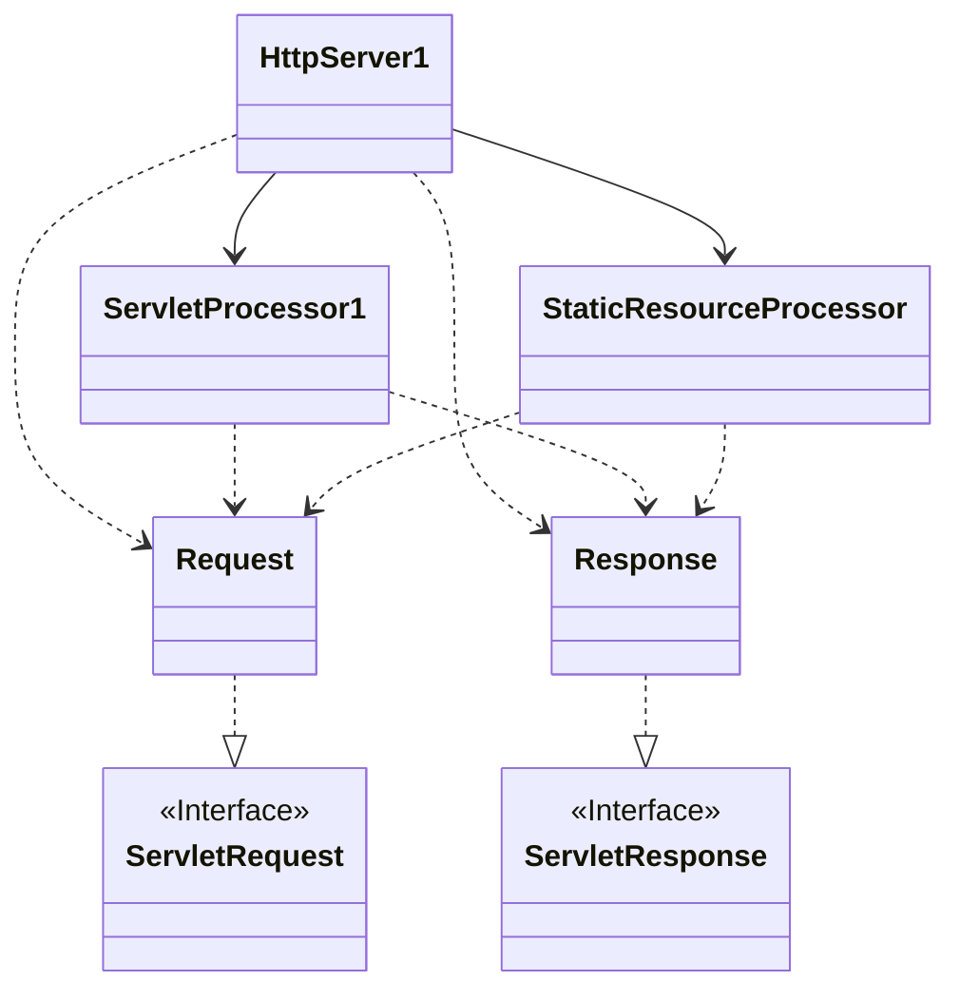
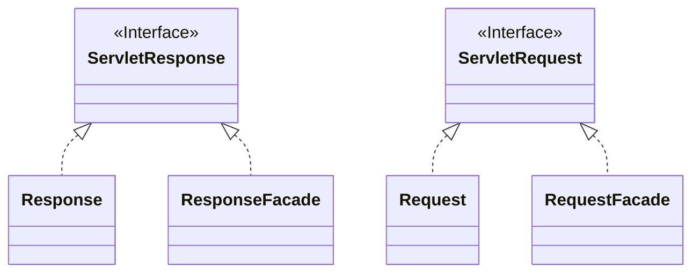

# 第2章:一个简单的Servlet容器

## 概要
本章通过两个程序来说明你如何开发自己的servlet容器。第一个程序被设计得足够简单使得你能理解一个servlet容器是如何工作的。然后它演变为第二个稍微复杂的servlet容器。 

> 注意：每一个servlet容器的应用程序都是从前一章的应用程序逐渐演变过来的，直至一个全功能的Tomcat servlet容器在第17章被建立起来。 

这两个servlet容器都可以处理简单的servlet和静态资源。你可以使用`PrimitiveServlet`来测试这个容器。`PrimitiveServlet`在Listing 2.1中列出并且它的类文件可以在`webroot`目录下找到。更复杂的`servlet`就超过这些容器的能力了，但是你将会在以下各章中学到如何建立更复杂的servlet容器。 

> Listing 2.1: PrimitiveServlet.java
```java
package ex02.pyrmont;

import javax.servlet.*;
import java.io.IOException;
import java.io.PrintWriter;

public class PrimitiveServlet implements Servlet {
    public void init(ServletConfig config) throws ServletException {
        System.out.println("init");
    }

    public void service(ServletRequest request, ServletResponse response) throws ServletException, IOException {
        System.out.println("from service");
        PrintWriter out = response.getWriter();
        out.println("Hello. Roses are red.");
        out.print("Violets are blue.");
    }

    public void destroy() {
        System.out.println("destroy");
    }

    public String getServletInfo() {
        return null;
    }

    public ServletConfig getServletConfig() {
        return null;
    }
}
```
{id="htw-listing-2-1"}

两个应用程序的类都放在`ex02.pyrmont`包里边。为了理解应用程序是如何工作的，你需要熟悉`javax.servlet.Servlet`接口。为了给你复习一下，将会在本章的首节讨论这个接口。在这之后，你将会学习一个servlet容器做了什么工作来为一个`servlet`提供HTTP请求。

### `javax.servlet.Servlet`接口

Servlet编程是通过`javax.servlet`和`javax.servlet.http`这两个包的类和接口来实现的。其中一个至关重要的就是`javax.servlet.Servlet`接口了。所有的servlet必须实现实现或者继承实现该接口的类。 

Servlet接口有五个方法，其用法如下。
```java
public void init(ServletConfig config) throws ServletException 

public void service(ServletRequest request, ServletResponse response) throws ServletException, java.io.IOException 

public void destroy() 

public ServletConfig getServletConfig()

public java.lang.String getServletInfo()

```
在Servlet的五个方法中，`init`，`service`和`destroy`是`servlet`的生命周期方法。在`servlet`类已经初始化之后，`init`方法将会被`servlet`容器所调用。`servlet`容器只调用一次，以此表明`servlet`已经被加载进服务中。`init`方法必须在`servlet`可以接受任何请求之前成功运行完毕。一个servlet程序可以通过覆盖这个方法来写那些仅仅只要运行一次的初始化代码，例如加载数据库驱动，值初始化等等。在其他情况下，这个方法通常是留空的。 

servlet容器为servlet请求调用它的`service`方法。servlet容器传递一个`javax.servlet.ServletRequest`对象和`javax.servlet.ServletResponse`对象。`ServletRequest`对象包括客户端的HTTP请求信息，而`ServletResponse`对象封装servlet的响应。在servlet的生命周期中，`service`方法将会给调用多次。 

当从服务中移除一个servlet实例的时候，servlet容器调用`destroy`方法。这通常发生在servlet容器正在被关闭或者servlet容器需要一些空闲内存的时候。仅仅在所有servlet线程的service方法已经退出或者超时淘汰的时候，这个方法才被调用。在servlet容器已经调用完`destroy`方法之后，在同一个servlet里边将不会再调用`service`方法。destroy方法提供了一个机会来清理任何已经被占用的资源，例如内存，文件句柄和线程，并确保任何持久化状态和servlet的内存当前状态是同步的。 

[Listing 2.1](#htw-listing-2-1)介绍了一个名为`PrimitiveServlet`的servlet的代码，是一个非常简单的的servlet，你可以用来测试本章里边的servlet容器应用程序。`PrimitiveServlet`类实现了`javax.servlet.Servlet`(所有的servlet都必须这样做)，并为Servlet的这五个方法都提供了实现。`PrimitiveServlet`做的事情非常简单。在`init`，`service`或者`destroy`中的任何一个方法每次被调用的时候，servlet把方法名写到标准控制台上面去。另外，service方法从`ServletResponse`对象获得`java.io.PrintWriter`实例，并发送字符串到浏览器去。

## 应用程序1

现在，让我们从一个servlet容器的角度来研究一下servlet编程。总的来说，一个全功能的servlet容器会为servlet的每个HTTP请求做下面一些工作：

* 当第一次调用servlet的时候，加载该servlet类并调用servlet的`init`方法(仅仅一次)。
* 对每次请求，构造一个`javax.servlet.ServletRequest`实例和一个`javax.servlet.ServletResponse`实例。
* 调用servlet的`service`方法，同时传递`ServletRequest`和`ServletResponse`对象。
* 当servlet类被关闭的时候，调用servlet的`destroy`方法并卸载servlet类。


本章的第一个servlet容器不是全功能的。因此，除了非常简单的servlet之外不能运行什么，而且也不调用servlet的`init`方法和`destroy`方法。相反它做了下面的事情：
* 等待HTTP请求。
* 构造一个`ServletRequest`对象和一个`ServletResponse`对象。
* 假如该请求需要一个静态资源的话，调用`StaticResourceProcessor`实例的`process`方法，同时传递`ServletRequest`和`ServletResponse`对象。
* 假如该请求需要一个servlet的话，加载servlet类并调用servlet的`service`方法，同时传递`ServletRequest`和`ServletResponse`对象。

> **注意**：在这个servlet容器中，每一次servlet被请求的时候，servlet类都会被加载。 
  
第一个应用程序由6个类组成：

* HttpServer1

* Request

* Response

* StaticResourceProcessor

* ServletProcessor1

* Constants

Figure 2.1显示了第一个servlet容器的UML图。

> Figure 2.1: 第一个servlet容器的UML图

{id="htw-figure-2-1"}

这个应用程序的入口点(静态main方法)可以在HttpServer1类里边找到。main方法创建了一个`HttpServer1`的实例并调用了它的await方法。`await`方法等待HTTP请求，为每次请求创建一个`Request`对象和一个`Response`对象，并把他们分发到一个`StaticResourceProcessor`实例或者一个`ServletProcessor`实例中去，这取决于请求一个静态资源还是一个servlet。 

`Constants`类包括涉及其他类的静态final变量WEB_ROOT。WEB_ROOT显示了`PrimitiveServlet`和这个容器可以提供的静态资源的位置。 `HttpServer1`实例会一直等待HTTP请求，直到接收到一个shutdown的命令。你可以用第1章的做法发送一个shutdown命令。 

应用程序里边的每个类都会在以下各节中进行讨论。

### HttpServer1类
这个应用程序里边的HttpServer1类类似于第1章里边的简单服务器应用程序的
HttpServer类。不过，在这个应用程序里边HttpServer1类可以同时提供静态资源和servlet。要请求一个静态资源，你可以在你的浏览器地址栏或者网址框里边敲入一个URL： 
```
http://machineName:port/staticResource
```
就像是在第1章提到的，你可以请求一个静态资源。 为了请求一个servlet，你可以使用下面的URL： 
```
http://machineName:port/servlet/servletClass
```
因此，假如你在本地请求一个名为PrimitiveServlet的servlet，你在浏览器的地址栏或者网址框中敲入： http://localhost:8080/servlet/PrimitiveServlet servlet容器可以就提供PrimitiveServlet了。不过，假如你调用其他servlet，如ModernServlet，servlet容器将会抛出一个异常。在以下各章中，你将会建立可以处理这两个情况的程序。 HttpServer1类显示在Listing 2.2中。 

> Listing 2.2: HttpServer1类的await方法
```java
package ex02.pyrmont;

import java.net.InetAddress;

public class HttpServer1 {
    /**
     * WEB_ROOT is the directory where our HTML and other files reside. * For this package, WEB_ROOT is the "webroot" directory under the * working directory. * The working directory is the location in the file system * from where the java command was invoked.
     */

    // shutdown command
    private static final String SHUTDOWN_COMMAND = "/SHUTDOWN";
    // the shutdown command received 
    private boolean shutdown = false;

    public static void main(String[] args) {
        HttpServer1 server = new HttpServer1();
        server.await();
    }

    public void await() {
        ServerSocket serverSocket = null;
        int port = 8080;
        try {
            serverSocket = new ServerSocket(port, 1, InetAddress.getByName("127.0.0.1"));
        } catch (IOException e) {
            e.printStackTrace();
            System.exit(1);
        } // Loop waiting for a request 
        while (!shutdown) {
            Socket socket = null;
            InputStream input = null;
            OutputStream output = null;
            try {
                socket = serverSocket.accept();
                input = socket.getInputstream();
                output = socket.getOutputStream();
                // create Request object and parse 
                Request request = new Request(input);
                request.parse();
                // create Response object 
                Response response = new Response(output);
                response.setRequest(request);
                //check if this is a request for a servlet or 
                // a static resource 
                // a request for a servlet begins with "/servlet/" 
                if (request.getUri().startsWith("/servlet/")) {
                    ServletProcessor1 processor = new ServletProcessor1();
                    processor.process(request, response);
                } else {
                    StaticResoureProcessor processor = new StaticResourceProcessor();
                    processor.process(request, response);
                }
                // Close the socket 
                socket.close();
                // check if the previous URI is a shutdown command 
                shutdown = request.getUri().equals(SHUTDOWN_COMMAND);
            } catch (Exception e) {
                e.printStackTrace();
                System.exit(1);
            }
        }
    }
}
```
{id="htw-listing-2-2}

类的await方法等待HTTP请求直到一个shutdown命令给发出，让你想起第1章的await方法。

Listing 2.2的await方法和第1章的区别是，在[Listing 2.2](#htw-listing-2-2)里边，请求可以分发给一个`StaticResourceProcessor`或者一个`ServletProcessor`。假如URI包括字符串/servlet/的话，请求将会转发到后面去。 

不然的话，请求将会传递给`StaticResourceProcessor`实例 `instance`. 请注意，这部分在Listing 2.2中灰暗显示。

### Request类
servlet的service方法从servlet容器中接收一个javax.servlet.ServletRequest实例和一个javax.servlet.ServletResponse实例。这就是说对于每一个HTTP请求，servlet容器必须构造一个ServletRequest对象和一个ServletResponse对象并把它们传递给正在服务的servlet的service方法。 ex02.pyrmont.Request类代表一个request对象并被传递给servlet的service方法。就本身而言，它必须实现javax.servlet.ServletRequest接口。这个类必须提供这个接口所有方法的实现。不过，我们想要让它非常简单并且仅仅提供实现其中一些方法，我们在以下各章中再实现全部的方法。要编译Request类，你需要把这些方法的实现留空。假如你看过Listing 2.3中的Request类，你将会看到那些需要返回一个对象的方法返回了null 

> Listing 2.3: Request类

```java
package ex02.pyrmont;

import javax.servlet.ServletInputStream;
import javax.servlet.ServletRequest;
import java.io.BufferedReader;
import java.io.IOException;
import java.io.InputStream;
import java.io.UnsupportedEncodingException;
import java.util.Enumeration;
import java.util.Locale;
import java.util.Map;

public class Request implements ServletRequest {
    private InputStream input;
    private String uri;

    public Request(InputStream input) {
        this.input = input;
    }

    public String getUri() {
        return uri;
    }

    private String parseUri(String requestString) {
        int index1, index2;
        index1 = requestString.indexOf(' ');
        if (index1 != -1) {
            index2 = requestString.indexOf(' ', index1 + 1);
            if (index2 > index1) return requestString.substring(index1 + 1, index2);
        }
        return null;
    }

    public void parse() {
        // Read a set of characters from the socket 
        StringBuffer request = new StringBuffer(2048);
        int i;
        byte[] buffer = new byte[2048];
        try {
            i = input.read(buffer);
        } catch (IOException e) {
            e.printStackTrace();
            i = -1;
        }
        for (int j = 0; j < i; j++) {
            request.append((char) buffer(j));
        }
        System.out.print(request.toString());
        uri = parseUri(request.toString());
    } /* implementation of ServletRequest */

    public Object getAttribute(String attribute) {
        return null;
    }

    public Enumeration getAttributeNames() {
        return null;
    }

    public String getRealPath(String path) {
        return null;
    }

    public RequestDispatcher getRequestDispatcher(String path) {
        return null;
    }

    public boolean isSecure() {
        return false;
    }

    public String getCharacterEncoding() {
        return null;
    }

    public int getContentLength() {
        return 0;
    }

    public String getContentType() {
        return null;
    }

    public ServletInputStream getInputStream() throws IOException {
        return null;
    }

    public Locale getLocale() {
        return null;
    }

    public Enumeration getLocales() {
        return null;
    }

    public String getParameter(String name) {
        return null;
    }

    public Map getParameterMap() {
        return null;
    }

    public Enumeration getParameterNames() {
        return null;
    }

    public String[] getParameterValues(String parameter) {
        return null;
    }

    public String getProtocol() {
        return null;
    }

    public BufferedReader getReader() throws IOException {
        return null;
    }

    public String getRemoteAddr() {
        return null;
    }

    public String getRemoteHost() {
        return null;
    }

    public String getScheme() {
        return null;
    }

    public String getServerName() {
        return null;
    }

    public int getServerPort() {
        return 0;
    }

    public void removeAttribute(String attribute) {
    }

    public void setAttribute(String key, Object value) {
    }

    public void setCharacterEncoding(String encoding) throws UnsupportedEncodingException {
    }
}
```
{id="htw-listing-2-3"}

另外，Request类仍然有在第1章中讨论的parse和getUri方法。

###  Response类

在Listing 2.4列出的ex02.pyrmont.Response类，实现了javax.servlet.ServletResponse。就本身而言，这个类必须提供接口里边的所有方法的实现。类似于Request类，我们把除了getWriter之外的所有方法的实现留空。 

> Listing 2.4: Response类

```java
package ex02.pyrmont;

import javax.servlet.ServletOutputStream;
import javax.servlet.ServletResponse;
import java.io.File;
import java.io.FileNotFoundException;
import java.io.IOException;
import java.io.OutputStream;
import java.io.PrintWriter;
import java.util.Locale;

public class Response implements ServletResponse {
    private static final int BUFFER_SIZE = 1024;
    Request request;
    OutputStream output;
    PrintWriter writer;

    public Response(OutputStream output) {
        this.output = output;
    }

    public void setRequest(Request request) {
        this.request = request;
    } /* This method is used to serve static pages */

    public void sendStaticResource() throws IOException {
        byte[] bytes = new byte[BUFFER_SIZE];
        FileInputstream fis = null;
        try { 
            /* request.getUri has been replaced by request.getRequestURI */
            File file = new File(Constants.WEB_ROOT, request.getUri());
            fis = new FileInputstream(file); 
            /* HTTP Response = Status-Line *(( general-header | response-header | entity-header ) CRLF) CRLF [ message-body ] Status-Line = HTTP-Version SP Status-Code SP Reason-Phrase CRLF */
            int ch = fis.read(bytes, 0, BUFFER_SIZE);
            while (ch != -1) {
                output.write(bytes, 0, ch);
                ch = fis.read(bytes, 0, BUFFER_SIZE);
            }
        } catch (FileNotFoundException e) {
            String errorMessage = "HTTP/1.1 404 File Not Found\r\n" + "Content-Type: text/html\r\n" + "Content-Length: 23\r\n" + "\r\n" + "<h1>File Not Found</h1>";
            output.write(errorMessage.getBytes());
        } finally {
            if (fis != null) fis.close();
        }
    }

    /**
     * implementation of ServletResponse
     */
    public void flushBuffer() throws IOException (
}

    public int getBufferSize() {
        return 0;
    }

    public String getCharacterEncoding() {
        return null;
    }

    public Locale getLocale() {
        return null;
    }

    public ServletOutputStream getOutputStream() throws IOException {
        return null;
    }

    public PrintWriter getWriter() throws IOException {
        // autoflush is true, println() will flush,
        // but print() will not. 
        writer = new PrintWriter(output, true);
        return writer;
    }

    public boolean isCommitted() {
        return false;
    }

    public void reset() {
    }

    public void resetBuffer() {
    }

    public void setBufferSize(int size) {
    }

    public void setContentLength(int length) {
    }

    public void setContentType(String type) {
    }

    public void setLocale(Locale locale) {
    }
}
```
{id="htw-listing-2-4"}

在`getWriter`方法中，`PrintWriter`类的构造方法的第二个参数是一个布尔值表明是否允许自动刷新。传递true作为第二个参数将会使任何println方法的调用都会刷新输出(output)。不过，print方法不会刷新输出。 因此，任何print方法的调用都会发生在servlet的service方法的最后一行，输出将不会被发送到浏览器。这个缺点将会在下一个应用程序中修复。 Response类还拥有在第1章中谈到的`sendStaticResource`方法。

###  StaticResourceProcessor类
`ex02.pyrmont.StaticResourceProcessor`类用来提供静态资源请求。唯一的方法是`process`方法。Listing 2.5给出了StaticResourceProcessor类。 

> Listing 2.5: StaticResourceProcessor类 
```java
package ex02.pyrmont;

import java.io.IOException;

public class StaticResourceProcessor {
    public void process(Request request, Response response) {
        try {
            response.sendStaticResource();
        } catch (IOException e) {
            e.printStackTrace();
        }
    }
} 
```
{id="htw-listing-2-5"}

process方法接收两个参数：一个`ex02.pyrmont.Request`实例和一个`ex02.pyrmont.Response`实例。这个方法只是简单的呼叫`Response`对象的`sendStaticResource`方法。


###  ServletProcessor1类
Listing 2.6中的`ex02.pyrmont.ServletProcessor1`类用于处理servlet的HTTP请求。 
  
> Listing 2.6: ServletProcessor1类
```java
package ex02.pyrmont;

import javax.servlet.Servlet;
import javax.servlet.ServletRequest;
import javax.servlet.ServletResponse;
import java.net.URLClassLoader;

public class ServletProcessor1 {
    public void process(Request request, Response response) {
        String uri = request.getUri();
        String servletName = uri.substring(uri.lastIndexOf("/") + 1);
        URLClassLoader loader = null;
        try {
            // create a URLClassLoader 
            URL[] urls = new URL[1];
            URLStreamHandler streamHandler = null;
            File classPath = new File(Constants.WEB_ROOT);
            // the forming of repository is taken from the 
            // createClassLoader method in 
            // org.apache.catalina.startup.ClassLoaderFactory 
            String repository = (new URL("file", null, classPath.getCanonicalPath() + File.separator)).toString();
            // the code for forming the URL is taken from 
            // the addRepository method in 
            // org.apache.catalina.loader.StandardClassLoader. 
            urls[0] = new URL(null, repository, streamHandler);
            loader = new URLClassLoader(urls);
        } catch (IOException e) {
            System.out.println(e.toString());
        }
        Class myClass = null;
        try {
            myClass = loader.loadClass(servletName);
        } catch (ClassNotFoundException e) {
            System.out.println(e.toString());
        }
        Servlet servlet = null;
        try {
            servlet = (Servlet) myClass.newInstance();
            servlet.service((ServletRequest) request, (ServletResponse) response);
        } catch (Exception e) {
            System.out.println(e.toString());
        } catch (Throwable e) {
            System.out.println(e.toString());
        }
    }
} 
```
{id="btw-listing-2-6}

ServletProcessor1类出奇的简单，仅仅由一个方法组成：`process`。这个方法接受两个参数：一个 `javax.servlet.ServletRequest`实例和一个j`avax.servlet.ServletResponse`实例。

该方法从`ServletRequest`中通过调用`getRequestUri`方法获得URI： 
```java
String uri = request.getUri();
```
请记住URI是以下形式的： 
```java
/servlet/servletName
```
在这里servletName是servlet类的名字。 要加载servlet类，我们需要从URI中知道servlet的名称。我们可以使用process方法的下一行来获得servlet的名字： 
```java
String servletName = uri.substring(uri.lastIndexOf("/") + 1); 
```
接下去，`process`方法加载servlet。要完成这个，你需要创建一个类加载器并告诉这个类加载器要加载的类的位置。

对于这个servlet容器，类加载器直接在Constants指向的目录里边查找。WEB_ROOT就是指向工作目录下面的webroot目录。 

> 注意： 类加载器将在第8章详细讨论。

要加载servlet，你可以使用`java.net.URLClassLoader`类，它是`java.lang.ClassLoader`类的一个直接子类。一旦你拥有一个`URLClassLoader`实例，你使用它的loadClass方法去加载一个servlet类。现在举例说明`URLClassLoader`类是`straightforward`直接转发的。这个类有三个构造方法，其中最简单的是： 
```java
public URLClassLoader(URL[] urls);
```

这里urls是一个`java.net.URL`的对象数组，这些对象指向了加载类时候查找的位置。任何以/结尾的URL都假设是一个目录。否则，URL会Otherwise, the URL假定是一个将被下载并在需要的时候打开的JAR文件。

>  注意：在一个servlet容器里边，一个类加载器可以找到servlet的地方被称为资源库(repository）。

在我们的应用程序里边，类加载器必须查找的地方**只有一个**，如工作目录下面的webroot目录。因此，我们首先创建一个单个URL组成的数组。URL类提供了一系列的构造方法，所以有很多中构造一个URL对象的方式。

对于这个应用程序来说，我们使用Tomcat中的另一个类的相同的构造方法。这个构造方法如下所示。

```java 
public URL(URL context, java.lang.String spec, URLStreamHandler hander) throws MalformedURLException 
```
你可以使用这个构造方法，并为第二个参数传递一个说明，为第一个和第三个参数都传递null。不过，这里有另外一个接受三个参数的构造方法：
```java 
public URL(java.lang.String protocol, java.lang.String host, java.lang.String file) throws MalformedURLException 
```
因此，假如你使用下面的代码时，编译器将不会知道你指的是那个构造方法： 
```java
new URL(null, aString, null);
```
你可以通过告诉编译器第三个参数的类型来避开这个问题，例如:
```java
URLStreamHandler streamHandler = null; 
new URL(null, aString, streamHandler); 
```
你可以使用下面的代码在组成一个包含资源库(servlet类可以被找到的地方)的字符串，并作为第二个参数， 
```java
String repository = (new URL("file", null, classPath.getCanonicalPath() + File.separator)).toString() ;
```
把所有的片段组合在一起，这就是用来构造适当的`URLClassLoader`实例的`process`方法中的一部分: 
```java
// create a URLClassLoader
URL[] urls = new URL[1];
URLStreamHandler streamHandler = null;
File classPath = new File(Constants.WEB_ROOT);
    
String repository = (new URL("file", null, classPath.getCanonicalPath() + File.separator)).toString();
urls[0] = new URL(null, repository, streamHandler);
loader = new URLClassLoader(urls);
```
> **注意**
>
>  用来生成资源库的代码是从`org.apache.catalina.startup.ClassLoaderFactory`的`createClassLoader`方法来的，而生成URL的代码是从`org.apache.catalina.loader.StandardClassLoader`的`addRepository`方法来的。不过，在以下各章之前你不需要担心这些类。 

当有了一个类加载器，你可以使用loadClass方法加载一个servlet：
```java
Class myClass = null;
try {
    myClass = loader.loadClass(servletName);
} catch (ClassNotFoundException e) {
    System.out.println(e.toString());
}
```

然后，process方法创建一个servlet类加载器的实例, 把它向下转换(downcast)为`javax.servlet.Servlet`, 并调用servlet的`service`方法： 
```java
Servlet servlet = null;
try {
    servlet = (Servlet) myClass.newInstance();
    servlet.service((ServletRequest) request, (ServletResponse) response);
} catch (Exception e) {
    System.out.println(e.toString());
} catch (Throwable e) {
    System.out.println(e.toString());
}
```

### 运行应用程序
要在Windows上运行该应用程序，在工作目录下面敲入以下命令： 
```shell
java -classpath ./lib/servlet.jar;./ ex02.pyrmont.HttpServer1 
```
在Linux下，你使用一个冒号来分隔两个库： 
```shell
java -classpath ./lib/servlet.jar:./ ex02.pyrmont.HttpServer1 
```
要测试该应用程序，在浏览器的地址栏或者网址框中敲入： http://localhost:8080/index.html 或者 http://localhost:8080/servlet/PrimitiveServlet 
 
当调用PrimitiveServlet的时候，你将会在你的浏览器看到下面的文本： Hello. Roses are red. 请注意，因为只是第一个字符串被刷新到浏览器，所以你不能看到第二个字符串Violets are blue。我们将在第3章修复这个问题。

## 应用程序2
第一个应用程序有一个严重的问题。在`ServletProcessor1`类的`process`方法，你向上转换`ex02.pyrmont.Request`实例为`javax.servlet.ServletRequest`，并作为第一个参数传递给servlet的`service`方法。你也向下转换`ex02.pyrmont.Response`实例为`javax.servlet.ServletResponse`，并作为第二个参数传递给servlet的service方法。
```java
try { 
   servlet = (Servlet) myClass.newInstance(); 
   servlet.service((ServletRequest) request,(ServletResponse) response); 
} 
```
  
这会危害安全性。知道这个servlet容器的内部运作的Servlet程序员可以分别把`ServletRequest`和`ServletResponse`实例向下转换为`ex02.pyrmont.Request`和`ex02.pyrmont.Response`，并调用他们的公共方法。拥有一个Request实例，它们就可以调用`parse`方法。拥有一个Response实例，就可以调用sendStaticResource方法。 

你不可以把`parse`和`sendStaticResource`方法设置为私有的，因为它们将会被其他的类调用。不过，这两个方法是在个servlet内部是不可见的。其中一个解决办法就是让`Request`和`Response`类拥有默认访问修饰，所以它们不能在`ex02.pyrmont`包的外部使用。不过，这里有一个更优雅的解决办法：通过使用`facade`类。
请看Figure 2.2中的UML图。 
> Figure 2.2: Façade classes

{id="htw-figure-2-2"}

在这第二个应用程序中，我们增加了两个façade类: `RequestFacade`和`ResponseFacade`。

`RequestFacade`实现了`ServletRequest`接口并通过在构造方法中传递一个引用了`ServletRequest`对象的`Request`实例作为参数来实例化。`ServletRequest`接口中每个方法的实现都调用了`Request`对象的相应方法。然而`ServletRequest`对象本身是私有的，并不能在类的外部访问。我们构造了一个`RequestFacade`对象并把它传递给`service`方法，而不是向下转换`Request`对象为`ServletRequest`对象并传递给service方法。Servlet程序员仍然可以向下转换`ServletRequest`实例为`RequestFacade`，不过它们只可以访问`ServletRequest`接口里边的公共方法。现在`parseUri`方法就是安全的了。Listing 2.7 显示了一个不完整的RequestFacade类 
> Listing 2.7: RequestFacade类
```java
package ex02.pyrmont;


public class RequestFacade implements ServletRequest {
    private ServleLRequest request = null;

    public RequestFacade(Request request) {
        this.request = request;
    } /* implementation of the ServletRequest*/

    public Object getAttribute(String attribute) {
        return request.getAttribute(attribute);
    }

    public Enumeration getAttributeNames() {
        return request.getAttributeNames();
    }
    
    // ... 
}
```

请注意`RequestFacade`的构造方法。它接受一个`Request`对象并马上赋值给私有的`servletRequest`对象。还请注意，`RequestFacade`类的每个方法调用`ServletRequest`对象的相应的方法。 
这同样使用于ResponseFacade类。 

这里是应用程序2中使用的类：
* `HttpServer2`
* `Request`
* `Response`
* `StaticResourceProcessor`
* `ServletProcessor2`
* `Constants`

`HttpServer2`类类似于HttpServer1，除了它在`await`方法中使用`ServletProcessor2`而不是`ServletProcessor1`： 

```java
if (request.getUri().startWith("/servlet/")) { 
    servletProcessor2 processor = new ServletProcessor2(); 
    processor.process(request, response); 
} else { ... } 
```

 
`ServletProcessor2`类类似于`ServletProcessor1`，除了`process`方法中的以下部分： 
```java
Servlet servlet = null; 
RequestFacade requestFacade = new RequestFacade(request); 
ResponseFacade responseFacade = new ResponseFacade(response); 
try { 
    servlet = (Servlet) myClass.newInstance(); 
    servlet.service((ServletRequest) requestFacade,(ServletResponse)responseFacade); 
}
```

### 运行应用程序
要在Windows上运行该应用程序，在工作目录下面敲入以下命令： `java -classpath ./lib/servlet.jar;./ ex02.pyrmont.HttpServer2` 

在Linux下，你使用一个冒号来分隔两个库： `java -classpath ./lib/servlet.jar:./ ex02.pyrmont.HttpServer2`

你可以使用与应用程序1一样的地址，并得到相同的结果。

## 总结 {id="htw-02-tldr"}
本章讨论了两个简单的可以用来提供静态资源和处理像`PrimitiveServlet`这么简单的servlet的servlet容器。同样也提供了关于`javax.servlet.Servlet`接口和相关类型的背景信息。