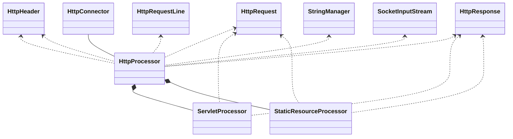
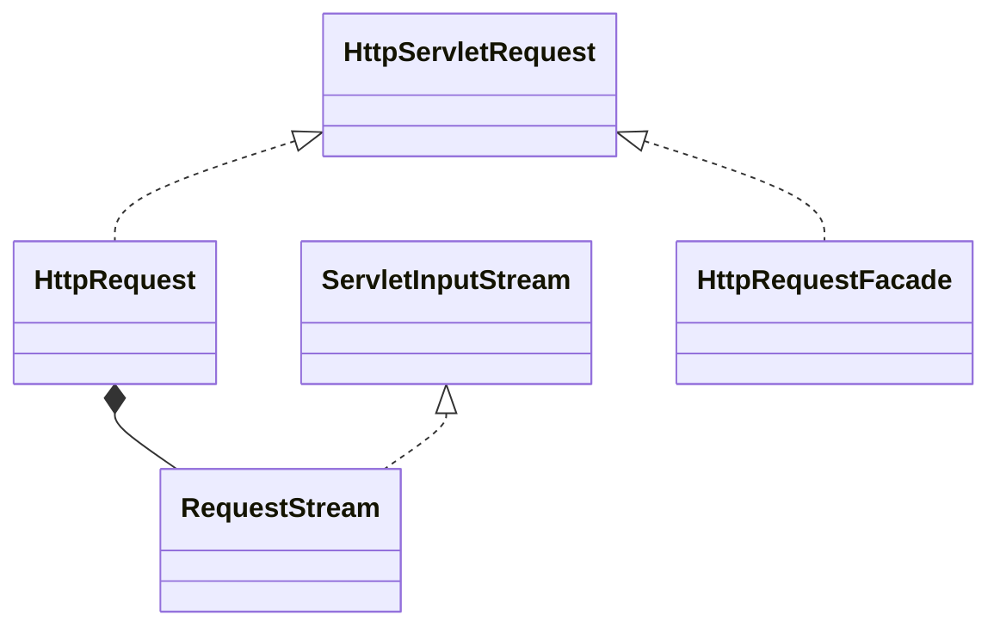
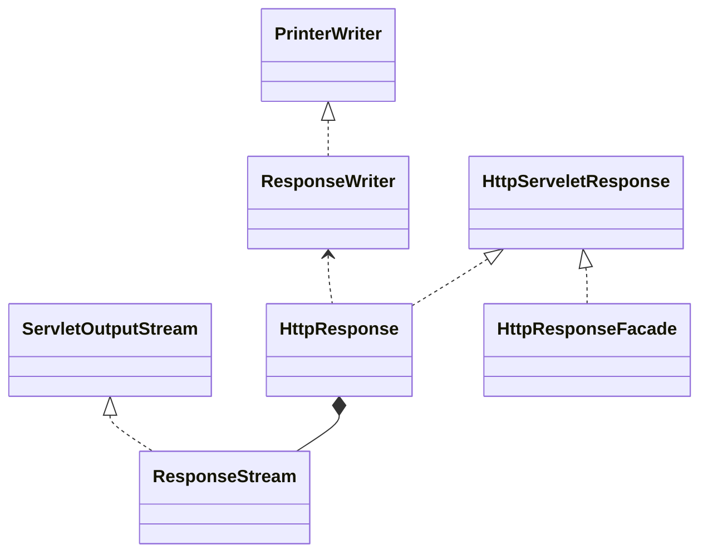

# 第3章:连接器
<show-structure for="chapter,procedure" depth="2"/>

## 概要
在介绍中提到，Catalina中有两个主要的模块：连接器和容器。本章中你将会写一个可以
创建更好的请求和响应对象的连接器，用来改进第2章中的程序。
一个符合Servlet 2.3和2.4规范的连接器必须创建j`avax.servlet.http.HttpServletRequest`和`javax.servlet.http.HttpServletResponse`，并传递给被调用的servlet的`service`方法。

在第2章中，servlet容器只可以运行实现了`javax.servlet.Servlet`的servlet，并传递 `javax.servlet.ServletRequest`和`javax.servlet.ServletResponse`实例给`service`方法。因为连接器并不知道servlet的类型(例如它是否实现了`javax.servlet.Servlet`，继承了`javax.servlet.GenericServlet`，或者继承了`javax.servlet.http.HttpServlet`)，所以连接器必须始终提供`HttpServletRequest`和`HttpServletResponse`的实例。 

在本章的应用程序中，连接器解析HTTP请求头部并让servlet可以获得头部, cookies, 参数名/值等等。你将会完善第2章中Response类的`getWriter`方法，让它能够正确运行。由于这些改进，你将会从`PrimitiveServlet`中获取一个完整的响应，并能够运行更加复杂的ModernServlet。

本章你建立的连接器是将在第4章详细讨论的Tomcat4的默认连接器的一个简化版本。*Tomcat的默认连接器在Tomcat4中是不推荐使用的*，但它仍然可以作为一个非常棒的学习工具。在这章的剩余部分，"connector"指的是内置在我们应用程序的模块。 

> **注意**
>
> 和上一章的应用程序不同的是，本章的应用程序中，连接器和容器是分离的。 

本章的应用程序可以在包`ex03.pyrmont`和它的子包中找到。组成连接器的这些类是包 `ex03.pyrmont.connector` 和`ex03.pyrmont.connector.http`的一部分。在本章的开头，每个附带的程序都有个bootstrap类用来启动应用程序。不过，在这个阶段，尚未有一个机制来停止这个应用程序。一旦运行，你必须通过关闭控制台(Windows)或者杀死进程(UNIX/Linux)的方法来鲁 莽的关闭应用程序。 

在我们解释该应用程序之前，让我们先来说说包`org.apache.catalina.util`里边的`StringManager`类。这个类用来处理这个程序中不同模块和Catalina自身的错误信息的国际化。之后会讨论附带的应用程序。

###  StringManager类
一个像Tomcat这样的大型应用需要仔细的处理错误信息。在Tomcat中，错误信息对于系统管理员和servlet程序员都是有用的。例如，Tomcat记录错误信息，让系统管理员可以定位发生的任何异常。对servlet程序员来说，Tomcat会在抛出的任何一个 `javax.servlet.ServletException`中发送一个错误信息，这样程序员可以知道他/她的servlet究竟发送什么错误了。
Tomcat所采用的方法是在一个属性文件里边存储错误信息，这样，可以容易的修改这些信息。不过，Tomcat中有数以百计的类。把所有类使用的错误信 息存储到一个大的属性文件里边将会容易产生维护的噩梦。为了避免这一情况，Tomcat为每个包都分配一个属性文件。例如，在包 `org.apache.catalina.connector`里边的属性文件包含了该包所有的类抛出的所有错误信息。每个属性文件都会被一个 `org.apache.catalina.util.StringManager`类的实例所处理。当Tomcat运行时，将会有许多 StringManager实例，每个实例会读取包对应的一个属性文件。

此外，由于Tomcat的受欢迎程度，提供多种语言的错误信息也是有意义的。目前，有三种语言是被支持的。英语的错误信息属性文件名为`LocalStrings.properties`。另外两个是西班牙语和日语，分别放在 `LocalStrings_es.properties`和`LocalStrings_ja.properties`里边。

当包里边的一个类需要查找放在该包属性文件的一个错误信息时，它首先会获得一个`StringManager`实例。不过，相同包里边的许多类可能也需要 `StringManager`，为每个对象创建一个`StringManager`实例是一种资源浪费。因此，`StringManager`类被设计成一个`StringManager`实例可以被包里边的所有类共享。

假如你熟悉设计模式，你将会正确的猜到`StringManager`是一个单例 (singleton)类。仅有的一个构造方法是私有的，所以你不能在类的外部使用new关键字来实例化。你通过传递一个包名来调用它的公共静态方法`getManager`来获得一个实例。每个实例存储在一个以包名为键(key)的Hashtable中。 
```java
private static Hashtable managers = new Hashtable(); 
public synchronized static StringManager getManager(String packageName) {  
    StringManager mgr = (StringManager)managers.get(packageName); 
    if (mgr == null) { 
        mgr = new StringManager(packageName); 
        managers.put(packageName, mgr); 
        } 
    return mgr; 
} 
```
> 注意：一篇关于单例模式的题为"The Singleton Pattern"的文章可以在附带的ZIP文件中找到。 

例如，要在包`ex03.pyrmont.connector.http`的一个类中使用`StringManager`，可以传递包名给`StringManager`类的`getManager`方法： 

```java
StringManager sm = StringManager.getManager("ex03.pyrmont.connector.http"); 
```

在包`ex03.pyrmont.connector.http`中，你会找到三个属性文件：`LocalStrings.properties`, `LocalStrings_es.properties`和`LocalStrings_ja.properties`。
`StringManager`实例是根据运行程序的服务器的区域设置来决定使用哪个文件的。假如你打开LocalStrings.properties，非注释的第一行是这样的： 
```
httpConnector.alreadyInitialized=HTTP connector has already been initialized 
```
要获得一个错误信息，可以使用`StringManager`类的`getString`，并传递一个错误代号。这是其中一个重载方法： 
```java
public String getString(String key)
```
通过传递`httpConnector.alreadyInitialized`作为getString的参数，将会返回"HTTP connector has already been initialized"。

## 应用程序
从本章开始，每章附带的应用程序都会分成模块。这章的应用程序由三个模块组成：connector, startup和core。 startup模块只有一个类，Bootstrap，用来启动应用的。connector模块的类可以分为五组：

* 连接器和它的支撑类(HttpConnector和HttpProcessor)。
* 指代HTTP请求的类(HttpRequest)和它的辅助类。
* 指代HTTP响应的类(HttpResponse)和它的辅助类。
* Facade类(HttpRequestFacade和HttpResponseFacade)。
* Constant类


core模块由两个类组成：`ServletProcessor`和`StaticResourceProcessor`。 

Figure 3.1显示了这个应用的类的UML图。为了让图更具可读性，HttpRequest和HttpResponse相关的类给省略了。你可以在我们讨论Request和Response对象的时候分别找到UML图。
> Figure 3.1: 应用程序的UML图

和Figure 2.1的UML图相比，第2章中的HttpServer类被分离为两个类：`HttpConnector`和`HttpProcessor`，`Request`被 `HttpRequest`所取代，而`Response`被`HttpRespons`e所取代。同样，本章的应用使用了更多的类。 第2章中的`HttpServer`类的职责是等待HTTP请求并创建请求和响应对象。

本章中，等待HTTP请求的工作交给`HttpConnector`实例，而创建请求和响应对象的工作交给了`HttpProcessor`实例。 HTTP请求对象由实现了`javax.servlet.http.HttpServletRequest`的`HttpRequest`类来代表。一个 `HttpRequest`对象将会给转换为一个`HttpServletRequest`实例并传递给被调用的servlet的service方法。

因此，每个 `HttpRequest`实例必须适当增加字段，以便servlet可以使用它们。值需要赋给`HttpRequest`对象，包括URI，查询字符串，参数，cookies和其他的头部等等。因为连接器并不知道被调用的servlet需要哪个值，所以连接器必须从HTTP请求中解析所有可获得的值。不过，解析一个HTTP请求牵涉昂贵的字符串和其他操作，假如只是解析servlet需要的值的话，连接器就能节省许多CPU周期。例如，假如servlet不解析任何一个请求参数(例如不调用`javax.servlet.http.HttpServletRequest`的`getParameter`, `getParameterMap`,`getParameterNames`或者`getParameterValues`方法)，连接器就不需要从查询字符串或者 HTTP请求内容中解析这些参数。

Tomcat的默认连接器(和本章应用程序的连接器)试图不解析参数直到servlet真正需要它的时候，通过这样来获得更高效率。 

Tomcat的默认连接器和我们的连接器使用`SocketInputStream`类来从套接字的`InputStream`中读取字节流。一个 `SocketInputStream`实例对从套接字的`getInputStream`方法中返回的`java.io.InputStream`实例进行包装。 `SocketInputStream`类提供了两个重要的方法：`readRequestLine`和`readHeader`。`readRequestLine`返回一个HTTP请求的第一行。例如，这行包括了URI，方法和HTTP版本。因为从套接字的输入流中处理字节流意味着只读取一次，从第一个字节到最后一个字节(并且不回退)，因此`readHeader`被调用之前，`readRequestLine`必须只被调用一次。`readHeader`每次被调用来获得一个头部的名/值对，并且应该被重复的调用知道所有的头部被读取到。`readRequestLine`的返回值是一个`HttpRequestLine`的实例，而 `readHeader`的返回值是一个`HttpHeader`对象。我们将在下节中讨论类`HttpRequestLine`和`HttpHeader`。 
  
`HttpProcessor`对象创建了`HttpRequest`的实例，因此必须在它们当中增加字段。`HttpProcessor`类使用它的`parse`方法 来解析一个HTTP请求中的请求行和头部。解析出来并把值赋给`HttpProcessor`对象的这些字段。不过，`parse`方法并不解析请求内容或者请求字符串里边的参数。这个任务留给了`HttpRequest`对象。只是当servlet需要一个参数时，查询字符串或者请求内容才会被解析。 另一个跟上一个应用程序比较的改进是用来启动应用程序的bootstrap类`ex03.pyrmont.startup.Bootstrap`的出现。 我们将会在下面的子节里边详细说明该应用程序：

* 启动应用程序
* 连接器
* 创建一个HttpRequest对象
* 创建一个HttpResponse对象
* 静态资源处理器和servlet处理器
* 运行应用程序


### 启动应用程序
你可以从`ex03.pyrmont.startup.Bootstrap`类来启动应用程序。这个类在Listing 3.1中给出。 
> Listing 3.1: Bootstrap类 
```java
package ex03.pyrmont.startup;

import ex03.pyrmont.connector.http.HttpConnector;

public final class Bootstrap {
    public static void main(String[] args) {
        HttpConnector connector = new HttpConnector();
        connector.start();
    }
} 
```
Bootstrap类中的main方法实例化`HttpConnector`类并调用它的`start`方法。HttpConnector类在Listing 3.2给出。 
> Listing 3.2: HttpConnector类的start方法
```java
package ex03.pyrmont.connector.http;

import java.io.IOException;
import java.net.InetAddress;
import java.net.ServerSocket;

public class HttpConnector implements Runnable {
    boolean stopped;
    private String scheme = "http";

    public String getScheme() {
        return scheme;
    }

    public void run() {
        ServerSocket serverSocket = null;
        int port = 8080;
        try {
            serverSocket = new ServerSocket(port, 1, InetAddress.getByName("127.0.0.1"));
        } catch (IOException e) {
            e.printStackTrace();
            System.exit(1);
        }
        while (!stopped) {
            // Accept the next incoming connection from the server socket 
            Socket socket = null;
            try {
                socket = serverSocket.accept();
            } catch (Exception e) {
                continue;
            }
            // Hand this socket off to an HttpProcessor 
            HttpProcessor processor = new HttpProcessor(this);
            processor.process(socket);
        }
    }

    public void start() {
        Thread thread = new Thread(this);
        thread.start();
    }
}
```
### 连接器
`ex03.pyrmont.connector.http.HttpConnector`类指代一个连接器，职责是创建一个服务器套接字用来等待前来的HTTP请求。这个类在Listing 3.2中出现。 `HttpConnector`类实现了`java.lang.Runnable`，所以它能被它自己的线程专用。当你启动应用程序，一个`HttpConnector`的实例被创建，并且它的run方法被执行。 
> 注意： 你可以通过读"Working with Threads"这篇文章来提醒你自己怎样创建Java线程。 

run方法包括一个while循环，用来做下面的事情：

* 等待HTTP请求
* 为每个请求创建个HttpProcessor实例
* 调用HttpProcessor的process方法

> 注意：run方法类似于第2章中HttpServer1类的await方法。

马上你就会看到`HttpConnector`类和`ex02.pyrmont.HttpServer1`类非常相像，除了从 `java.net.ServerSocket`类的`accept`方法中获得一个套接字之后，一个`HttpProcessor`实例会被创建，并且通过传递该套接字给它的`process`方法调用。

> 注意：`HttpConnector`类有另一个方法叫`getScheme`，用来返回一个scheme(HTTP)。

`HttpProcessor`类的`process`方法接受前来的HTTP请求的套接字，会做下面的事情： 
1. 创建一个`HttpRequest`对象。 
2. 创建一个`HttpResponse`对象。 
3. 解析HTTP请求的第一行和头部，并放到`HttpRequest`对象。 
4. 解析HttpRequest和HttpResponse对象到一个`ServletProcessor`或者 `StaticResourceProcessor`。(像第2章里边说的，`ServletProcessor`调用被请求的servlet的`service`方 法，而`StaticResourceProcessor`发送一个静态资源的内容。)

process方法在Listing 3.3给出. 

> Listing 3.3: HttpProcessor类process方法

```java
    public void process(Socket socket) {
        SocketInputStream input = null;
        OutputStream output = null;
        try {
            input = new SocketInputStream(socket.getInputStream(), 2048);
            output = socket.getOutputStream();
            // create HttpRequest object and parse 
            request = new HttpRequest(input);
            // create HttpResponse object 
            response = new HttpResponse(output);
            response.setRequest(request);
            response.setHeader("Server", "Pyrmont Servlet Container");
            parseRequest(input, output);
            parseHeaders(input);
            //check if this is a request for a servlet or a static resource 
            // a request for a servlet begins with "/servlet/" 
            if (request.getRequestURI().startsWith("/servlet/")) {
                ServletProcessor processor = new ServletProcessor();
                processor.process(request, response);
            } else {
                StaticResourceProcessor processor = new StaticResourceProcessor();
                processor.process(request, response);
            }
            // Close the socket 
            socket.close();
            // no shutdown for this application 
        } catch (Exception e) {
            e.printStackTrace();
        }
    }
```
`process`首先获得套接字的输入流和输出流。请注意，在这个方法中，我们适合继承了`java.io.InputStream`的`SocketInputStream`类。 
```java
SocketInputStream input = null; 
OutputStream output = null; 
try { 
    input = new SocketInputStream(socket.getInputStream(), 2048); 
    output = socket.getOutputStream();
```
然后，创建一个` HttpRequest `实例和一个 `HttpResponse` 实例，并将 `HttpRequest` 分配给 `HttpResponse`。 
```java
// create HttpRequest object and parse 
request = new HttpRequest(input); 
// create HttpResponse object 
response = new HttpResponse(output); 
response.setRequest(request); 
```
本章应用程序的`HttpResponse`类要比第2章中的`Response`类复杂得多。首先，你可以通过调用它的 `setHeader` 方法向客户端发送头信息。 
```java
response.setHeader("Server", "Pyrmont Servlet Container");
```
接下来，处理方法会调用 `HttpProcessor` 类中的两个私有方法来解析请求。 
```java
parseRequest(input, output); 
parseHeaders (input);
```
然后，它根据请求URI的形式把`HttpRequest`和`HttpResponse`对象传给`ServletProcessor`或者`StaticResourceProcessor`进行处理。 
```java
if (request.getRequestURI().startsWith("/servlet/")) { 
    ServletProcessor processor = new ServletProcessor(); 
    processor.process(request, response);
} else { 
    StaticResourceProcessor processor = new StaticResourceProcessor(); processor.process(request, response); 
} 
```
最后，关闭套接字。 
```java
socket.close();
```

请注意，`HttpProcessor`类使用`org.apache.catalina.util.StringManager`类来发送错误信息： 
```java
protected StringManager sm = StringManager.getManager("ex03.pyrmont.connector.http");
```
`HttpProcessor`类中的私有方法--`parseRequest`，`parseHeaders`和`normalize`，是用来帮助填充HttpRequest的。这些方法将会在下节"创建一个HttpRequest对象"中进行讨论。
### 创建一个HttpRequest对象
`HttpRequest`类实现了`javax.servlet.http.HttpServletRequest`。跟随它的是一个叫做 `HttpRequestFacade`的facade类。Figure 3.2显示了HttpRequest类和它的相关类的UML图。 

> Figure 3.2: HttpRequest类和它的相关类


HttpRequest类的很多方法都留空(你需要等到第4章才会完全实现)，但是servlet程序员已经可以从到来的HTTP请求中获得头部，cookies和参数。这三种类型的值被存储在下面几个引用变量中： 
```java
protected HashMap headers = new HashMap(); 
protected ArrayList cookies = new ArrayList(); 
protected ParameterMap parameters = null; 
```
> 注意：ParameterMap类将会在“获取参数”这节中解释。

因此，一个servlet程序员可以从`javax.servlet.http.HttpServletRequest`中的下列方法中取得正确的返回值：`getCookies`,`getDateHeader`,`getHeader`, `getHeaderNames`, `getHeaders`, `getParameter,` `getPrameterMap`,`getParameterNames`和`getParameterValues`。正如你在`HttpRequest`类中看到的一样，一旦获得了正确的头信息、cookie 和参数值，相关方法的实现就很容易了。 

不用说，这里主要的挑战是解析HTTP请求和填充`HttpRequest`类。对于headers和cookies，`HttpRequest`类提供了`addHeader`和`addCookie`方法用于`HttpProcessor`的`parseHeaders`方法调用。当需要的时候，会使用 `HttpRequest`类的`parseParameters`方法来解析参数。在本节中所有的方法都会被讨论。 因为HTTP请求的解析是一项相当复杂的任务，所以本节会分为以下几个小节：

* 读取套接字的输入流
* 解析请求行
* 解析头部
* 解析cookies
* 获取参数

#### 读取套接字的输入流
在第1章和第2章中，你在`ex01.pyrmont.HttpRequest`和`ex02.pyrmont.HttpRequest`类中做了一点请求解析。 你通过调用`java.io.InputStream`类的`read`方法获取了请求行，包括方法，URI和HTTP版本： 
```java
byte[] buffer = new byte [2048];
try {
    // input is the InputStream from the socket.
    i = input.read(buffer);
}
```
你没有试图为那两个应用程序去进一步解析请求。不过，在本章的应用程序中，你拥有 `ex03.pyrmont.connector.http.SocketInputStream`类，这是 `org.apache.catalina.connector.http.SocketInputStream`的一个拷贝。这个类提供了方法不仅用来获取请求行，还有请求头部。 

通过传递一个`InputStream`和一个指代实例使用的缓冲区大小的整数，来构建一个`SocketInputStream`实例。在本章中，你在 `ex03.pyrmont.connector.http.HttpProcessor`的`process`方法中创建了一个 `SocketInputStream`对象，就像下面的代码片段一样： 
```java
SocketInputStream input = null; 
OutputStream output = null; 
try { 
    input = new SocketInputStream(socket.getInputStream(), 2048); 
    ...
```
拥有一个`SocketInputStream`是为了两个重要方法：`readRequestLine`和`readHeader`。请继续往下阅读。


#### 解析请求行
HttpProcessor的process方法调用私有方法parseRequest用来解析请求行，例如一个HTTP请求的第一行。这里是一个请求行的例子： 
```http
GET /myApp/ModernServlet?userName=tarzan&password=pwd HTTP/1.1 
```
请求行的第二部分是URI加上一个查询字符串。在上面的例子中，URI是这样的： 
```http
/myApp/ModernServlet
``` 
另外，在问好后面的任何东西都是查询字符串。因此，查询字符串是这样的： 

```http
userName=tarzan&password=pwd
```
查询字符串可以包括零个或多个参数。在上面的例子中，有两个参数名/值对，`userName/tarzan`和`password/pwd`。在servlet/JSP编程中，参数名`jsessionid`是用来携带一个会话标识符。会话标识符经常被作为cookie来嵌入，但是程序员可以选择把它嵌入到查询字
符串去，例如，当浏览器的cookie被禁用的时候。 

当`parseRequest`方法被`HttpProcessor`类的`process`方法调用的时候，request变量指向一个HttpRequest实例。parseRequest方法解析请求行用来获得几个值并把这些值赋给HttpRequest对象。现在，让我们来关注一下在Listing 3.4中的parseRequest方法。 
> Listing 3.4：HttpProcessor类中的parseRequest方法
```java
private void parseRequest(SocketInputStream input, OutputStream output) throws IOException, ServletException {
        // Parse the incoming request line
        input.readRequestLine(requestLine);
        String method = new String(requestLine.method, 0, requestLine.methodEnd);
        String uri = null;
        String protocol = new String(requestLine.protocol, 0, requestLine.protocolEnd);
        // Validate the incoming request line
        if (method.length() < 1){
            throw new ServletException("Missing HTTP request method");
        } else if (requestLine.uriEnd < 1) {
            throw new ServletException("Missing HTTP request URI");
        }
        // Parse any query parameters out of the request URI
        int question = requestLine.indexOf("?");
        if (question >= 0) {
            request.setQueryString(new String(requestLine.uri, question + 1, requestLine.uriEnd - question - 1));
            uri = new String(requestLine.uri, 0, question);
        } else {
            request.setQueryString(null);
            uri = new String(requestLine.uri, 0, requestLine.uriEnd);
        }
        // Checking for an absolute URI (with the HTTP protocol)
        if (!uri.startsWith("/")) {
            int pos = uri.indexOf("://");
            // Parsing out protocol and host name
            if (pos != -1) {
                pos = uri.indexOf('/', pos + 3);
                if (pos == -1) {
                    uri = "";
                } else {
                    uri = uri.substring(pos);
                }
            }
        }
        // Parse any requested session ID out of the request URI
        String match = ";jsessionid=";
        int semicolon = uri.indexOf(match);
        if (semicolon >= 0) {
            String rest = uri.substring(semicolon + match, length());
            int semicolon2 = rest.indexOf(';');
            if (semicolon2 >= 0) {
                request.setRequestedSessionId(rest.substring(0, semicolon2));
                rest = rest.substring(semicolon2);
            } else {
                request.setRequestedSessionId(rest);
                rest = "";
            }
            request.setRequestedSessionURL(true);
            uri = uri.substring(0, semicolon) + rest;
        } else {
            request.setRequestedSessionId(null);
            request.setRequestedSessionURL(false);
        }
        // Normalize URI (using String operations at the moment)
        String normalizedUri = normalize(uri);
        // Set the corresponding request properties
        ((HttpRequest) request).setMethod(method);
        request.setProtocol(protocol);
        if (normalizedUri != null) {
            ((HttpRequest) request).setRequestURI(normalizedUri);
        } else {
            ((HttpRequest) request).setRequestURI(uri);
        }
        if (normalizedUri == null) {
            throw new ServletException("Invalid URI: " + uri + "'");
        }
    }
```
`parseRequest`方法首先调用`SocketInputStream`类的`readRequestLine`方法： 
```java
input.readRequestLine(requestLine);
```

在这里`requestLine`是`HttpProcessor`里边的`HttpRequestLine`的一个实例： 
```java
private HttpRequestLine requestLine = new HttpRequestLine();
```
调用它的`readRequestLine`方法来告诉`SocketInputStream`去填入`HttpRequestLine`实例。 接下去，`parseRequest`方法获得请求行的方法，URI和协议： 
```java
String method = new String(requestLine.method, 0, requestLine.methodEnd); 
String uri = null; 
String protocol = new String(requestLine.protocol, 0, requestLine.protocolEnd);
```
不过，在URI后面可以有查询字符串，假如存在的话，查询字符串会被一个问好分隔开来。因此，parseRequest方法试图首先获取查询字符串。并调用setQueryString方法来填充HttpRequest对象：

```java
// Parse any query parameters out of the request URI 
int question = requestLine.indexOf("?");
if (question >= 0) {
    request.setQueryString(new String(requestLine.uri, question + 1, requestLine.uriEnd - question - 1));
        uri = new String(requestLine.uri, 0, question);
} else {
    request.setQueryString(null);
    uri = new String(requestLine.uri, 0, requestLine.uriEnd);
}
```
不过，大多数情况下，URI指向一个相对资源，URI还可以是一个绝对值，就像下面所示：
```
http://www.brainysoftware.com/index.html?name=Tarzan
```
`parseRequest`方法同样也检查这种情况： 
```java
 // Checking for an absolute URI (with the HTTP protocol)
        if (!uri.startsWith("/")) {
            int pos = uri.indexOf("://");
            // Parsing out protocol and host name
            if (pos != -1) {
                pos = uri.indexOf('/', pos + 3);
                if (pos == -1) {
                    uri = "";
                } else {
                    uri = uri.substring(pos);
                }
            }
        }
```
然后，查询字符串也可以包含一个会话标识符，用`jsessionid`参数名来指代。因此，`parseRequest`方法也检查一个会话标识符。假如在查询字符串里边找到`jessionid`，方法就取得会话标识符，并通过调用`setRequestedSessionId`方法把值交给`HttpRequest`实例： 
```java
// Parse any requested session ID out of the request URI
        String match = ";jsessionid=";
        int semicolon = uri.indexOf(match);
        if (semicolon >= 0) {
            String rest = uri.substring(semicolon + match, length());
            int semicolon2 = rest.indexOf(';');
            if (semicolon2 >= 0) {
                request.setRequestedSessionId(rest.substring(0, semicolon2));
                rest = rest.substring(semicolon2);
            } else {
                request.setRequestedSessionId(rest);
                rest = "";
            }
            request.setRequestedSessionURL(true);
            uri = uri.substring(0, semicolon) + rest;
        } else {
            request.setRequestedSessionId(null);
            request.setRequestedSessionURL(false);
        }
```
当`jsessionid`被找到，也意味着会话标识符是携带在查询字符串里边，而不是在cookie里边。因此，传递`true`给`request`的 `setRequestSessionURL`方法。否则，传递false给`setRequestSessionURL`方法并传递`null`给 `setRequestedSessionURL`方法。 到这个时候，`uri`的值已经被去掉了`jsessionid`。 

接下去，`parseRequest`方法传递`uri`给`normalize`方法，用于纠正“异常”的URI。例如，任何\的出现都会给/替代。假如`uri`是正确的格式或者异常可以给纠正的话，`normalize`将会返回相同的或者被纠正后的URI。假如URI不能纠正的话，它将会给认为是非法的并且通常会返回`null`。在这种情况下(通常返回`null`)，`parseRequest`将会在方法的最后抛出一个异常。 

最后，parseRequest方法设置了HttpRequest的一些属性： 
```java
((HttpRequest) request).setMethod(method);
request.setProtocol(protocol);
if (normalizedUri != null) {
    ((HttpRequest) request).setRequestURI(normalizedUri);
} else {
    ((HttpRequest) request).setRequestURI(uri);
}
```
还有，假如`normalize`方法的返回值是`null`的话，方法将会抛出一个异常：
```java
if (normalizedUri == null) {
throw new ServletException("Invalid URI: " + uri + "'"); }
```
#### 解析头部
  一个HTTP头部是用类HttpHeader来代表的。这个类将会在第4章详细解释，而现在知道下面的内容就足够了：

* 你可以通过使用类的无参数构造方法构造一个HttpHeader实例。
* 一旦你拥有一个HttpHeader实例，你可以把它传递给SocketInputStream的readHeader方法。假如这里有头部需要读取，readHeader方法将会相应的填充HttpHeader对象。假如再也没有头部需要读取了，HttpHeader实例的nameEnd和valueEnd字段将会置零。
* 为了获取头部的名称和值，使用下面的方法：
```java
String name = new String(header.name, 0, header.nameEnd);
String value = new String(header.value, 0, header.valueEnd);
```


`parseHeaders`方法包括一个while循环用于持续的从SocketInputStream中读取头部，直到再也没有头部出现为止。循环从构建一个HttpHeader对象开始，并把它传递给类SocketInputStream的readHeader方法： 
```java
HttpHeader header = new HttpHeader(); 
// Read the next header 
input.readHeader(header);
```
然后，你可以通过检测`HttpHeader`实例的`nameEnd`和`valueEnd`字段来测试是否可以从输入流中读取下一个头部信息： 
```java
if (header.nameEnd == 0) { 
    if (header.valueEnd == 0) { return; } 
    else { 
        throw new ServletException(
            sm.getString("httpProcessor.parseHeaders.colon")
        ); 
    }
}
```
假如存在下一个头部，那么头部的名称和值可以通过下面方法进行检索： 
```java
String name = new String(header.name, 0, header.nameEnd); 
String value = new String(header.value, 0, header.valueEnd);
```
一旦你获取到头部的名称和值，你通过调用`HttpRequest`对象的`addHeader`方法来把它加入headers这个HashMap中： 
```java
request.addHeader(name, value);
```
 一些头部也需要某些属性的设置。例如，当servlet调用`javax.servlet.ServletRequest`的`getContentLength`方法的时候，`content-length`头部的值将被返回。而包含`cookies`的cookie头部将会给添加到cookie集合中。就这样，下面是其中一些过程：
 ```java
  if (name.equals("cookie")) { ... // process cookies here } else if (name.equals("content-length")) { int n = -1; try { n = Integer.parseInt (value); } catch (Exception e) { throw new ServletException(sm.getString( "httpProcessor.parseHeaders.contentLength")); } request.setContentLength(n); } else if (name.equals("content-type")) { request.setContentType(value); }
 ```
Cookie的解析将会在下一节“解析Cookies”中讨论。
#####  解析Cookies
Cookies是作为一个Http请求头部通过浏览器来发送的。这样一个头部名为"cookie"并且它的值是一些cookie名/值对。这里是一个包括两个cookie:`username`和`password`的cookie头部的例子。 
```
Cookie: userName=budi; password=pwd;
```
Cookie的解析是通过类`org.apache.catalina.util.RequestUtil`的`parseCookieHeader`方法来处理的。这个方法接受cookie头部并返回一个`javax.servlet.http.Cookie`数组。数组内的元素数量和头部里边的cookie名/值对个数是一样的。parseCookieHeader方法在Listing 3.5中列出。 

> Listing 3.5: The org.apache.catalina.util.RequestUtil class's parseCookieHeader method
```java
  public static Cookie[] parseCookieHeader(String header) {
        if ((header == null) || (header.length 0 < 1) )return (new Cookie[0]);
        ArrayList cookies = new ArrayList();
        while (header.length() > 0) {
            int semicolon = header.indexOf(';');
            if (semicolon < 0) semicolon = header.length();
            if (semicolon == 0) break;
            String token = header.substring(0, semicolon);
            if (semicolon < header.length()) header = header.substring(semicolon + 1);
            else header = "";
            try {
                int equals = token.indexOf('=');
                if (equals > 0) {
                    String name = token.substring(0, equals).trim();
                    String value = token.substring(equals + 1).trim();
                    cookies.add(new Cookie(name, value));
                }
            } catch (Throwable e) {
                ;
            }
        }
        return ((Cookie[]) cookies.toArray(new Cookie[cookies.size()]));
    }
```
还有，这里是`HttpProcessor`类的`parseHeader`方法中用于处理cookie的部分代码: 
```java
else if (header.equals(DefaultHeaders.COOKIE_NAME)) {
    Cookie cookies[] = RequestUtil.ParseCookieHeader(value);
    for (int i = 0; i < cookies.length; i++) {
        if (cookies[i].getName().equals("jsessionid")) {
            // Override anything requested in the URL
            if (!request.isRequestedSessionIdFromCookie()) {
                // Accept only the first session id cookie
                request.setRequestedSessionId(cookies[i].getValue());
                request.setRequestedSessionCookie(true);
               request.setRequestedSessionURL(false);
            }
        }
        request.addCookie(cookies[i]);
    }
}
```

  
##### 获取参数
你不需要马上解析查询字符串或者HTTP请求内容，直到servlet需要通过调用`javax.servlet.http.HttpServletRequest`的`getParameter`, `getParameterMap`, `getParameterNames`或者`getParameterValues`方法来读取参数。
  
因此`，HttpRequest`的这四个方法开头调用了`parseParameter`方法。 这些参数只需要解析一次就够了，因为假如参数在请求内容里边被找到的话，参数解析将会使得`SocketInputStream`到达字节流的尾部。类`HttpRequest`使用一个布尔变量parsed来指示是否已经解析过了。

参数可以在查询字符串或者请求内容里边找到。假如用户使用`GET`方法来请求servlet的话，所有的参数将在查询字符串里边出现。假如使用`POST`方法的话，你也可以在请求内容中找到一些。所有的名/值对将会存储在一个`HashMap`里边。

Servlet程序员可以以Map的形式获得参数(通过调用HttpServletRequest的getParameterMap方法)和参数名/值。There is a catch, though. Servlet程序员不被允许修改参数值。因此，将使用一个特殊的HashMap：`org.apache.catalina.util.ParameterMap`。 类ParameterMap继承`java.util.HashMap`，并使用了一个布尔变量`locked`。当`locked`是false的时候，名/值对仅仅可以添加，更新或者移除。否则，异常`IllegalStateException`会抛出。而随时都可以读取参数值。 类`ParameterMap`将会在Listing 3.6中列出。它覆盖了方法用于增加，更新和移除值。那些方法仅仅在locked为false的时候可以调用。 

> Listing 3.6: The org.apache.Catalina.util.ParameterMap class.

```java
package org.apache.catalina.util;

import java.util.HashMap;
import java.util.Map;

public final class ParameterMap extends HashMap {
    public ParameterMap() {
        super();
    }

    public ParameterMap(int initialCapacity) {
        super(initialCapacity);
    }

    public ParameterMap(int initialCapacity, float loadFactor) {
        super(initialCapacity, loadFactor);
    }

    public ParameterMap(Map map) {
        super(map);
    }

    private boolean locked = false;

    public boolean isLocked() {
        return (this.locked);
    }

    public void setLocked(boolean locked) {
        this.locked = locked;
    }

    private static final StringManager sm = StringManager.getManager("org.apache.catalina.util");

    public void clear() {
        if (locked) throw new IllegalStateException(sm.getString("parameterMap.locked"));
        super.clear();
    }

    public Object put(Object key, Object value) {
        if (locked) throw new IllegalStateException(sm.getString("parameterMap.locked"));
        return (super.put(key, value));
    }

    public void putAll(Map map) {
        if (locked) throw new IllegalStateException(sm.getString("parameterMap.locked"));
        super.putAll(map);
    }

    public Object remove(Object key) {
        if (locked) throw new IllegalStateException(sm.getString("parameterMap.locked"));
        return (super.remove(key));
    }
}
```
现在，让我们来看`parseParameters`方法是怎么工作的。 
 
因为参数可以存在于查询字符串或者HTTP请求内容中，所以`parseParameters`方法会检查查询字符串和请求内容。一旦解析过后，参数将会在对象变量parameters中找到，所以方法的开头会检查parsed布尔变量，假如已经解析过的话，parsed将会返回`true`。
 
```java
if (parsed) return;
```
然后，`parseParameters`方法创建一个名为`results`的`ParameterMap`变量，并指向`parameters`。假如` parameters`为null的话，它将创建一个新的`ParameterMap`。
```java
 ParameterMap results = parameters; 
 if (results == null) results = new ParameterMap(); 
```
然后，`parseParameters`方法打开`parameterMap`的锁以便写值。 
```java
results.setLocked(false);
``` 

下一步，`parseParameters`方法检查字符编码，并在字符编码为null的时候赋予默认字符编码。 
```java
String encoding = getCharacterEncoding(); 
if (encoding == null) encoding = "ISO-8859-1";
```
然后，`parseParameters`方法尝试解析查询字符串。解析参数是使用o`rg.apache.Catalina.util.RequestUtil`的`parseParameters`方法来处理的。
```java
// Parse any parameters specified in the query string 
String queryString = getQueryString(); 
try { 
    RequestUtil.parseParameters(results, queryString, encoding); 
} catch (UnsupportedEncodingException e) { ; }
```
接下来，方法尝试查看HTTP请求内容是否包含参数。这种情况发生在当用户使用POST方法发送请求的时候，内容长度大于零，并且内容类型是`application/x-www-form-urlencoded`的时候。所以，这里是解析请求内容的代码：
```java
// Parse any parameters specified in the input stream String contentType = getContentType(); if (contentType == null) contentType = ""; int semicolon = contentType.indexOf(';'); if (semicolon >= 0) { contentType = contentType.substring (0, semicolon).trim(); } else { contentType = contentType.trim(); } if ("POST".equals(getMethod()) && (getContentLength() > 0) && "application/x-www-form-urlencoded".equals(contentType)) { try { int max = getContentLength(); int len = 0; byte buf[] = new byte[getContentLength()]; ServletInputStream is = getInputStream(); while (len < max) { int next = is.read(buf, len, max - len); if (next < 0 ) { break; } len += next; } is.close(); if (len < max) { throw new RuntimeException("Content length mismatch"); } RequestUtil.parseParameters(results, buf, encoding); }
catch (UnsupportedEncodingException ue) { ; } catch (IOException e) { throw new RuntimeException("Content read fail"); } }

```
最后，`parseParameters`方法锁定`ParameterMap`，设置parsed为true，并把results赋予parameters。 
```java
// Store the final results results.setLocked(true);
parsed = true; parameters = results;
```

### 创建一个HttpResponse对象
`HttpResponse`类实现了`javax.servlet.http.HttpServletResponse`。跟随它的是一个叫做`HttpResponseFacade`的façade类。Figure 3.3显示了HttpResponse类和它的相关类的UML图。


在第2章中，你使用的是一个部分实现的`HttpResponse`类。例如，它的`getWriter`方法，在它的其中一个print方法被调用的时候，返回一个不会自动清除的`java.io.PrintWriter`对象。在本章中应用程序将会修复这个问题。

为了理解它是如何修复的，你需要知道Writer是什么东西来的。 在一个servlet里边，你使用`PrintWriter`来写字节。你可以使用任何你希望的编码，但是这些字节将会以字节流的形式发送到浏览器去。

因此，第2章中`ex02.pyrmont.HttpResponse`类的`getWriter`方法就不奇怪了： 
```java
public PrintWriter getWriter() { 
    // if autoflush is true, println() will flush, 
    // but print() will not. 
    // the output argument is an 
    OutputStream writer = new PrintWriter(output, true); 
    return writer; 
}
```
请看，我们是如何构造一个`PrintWriter`对象的?就是通过传递一个`java.io.OutputStream`实例来实现的。你传递给`PrintWriter`的`print`或`println`方法的任何东西都是通过底下的`OutputStream`进行发送的。

在本章中，你为`PrintWriter`使用`ex03.pyrmont.connector.ResponseStream`类的一个实例来替代 `OutputStream`。需要注意的是，类`ResponseStream`是间接的从类`java.io.OutputStream`传递过去的。 同样的你使用了继承于`PrintWriter`的类`ex03.pyrmont.connector.ResponseWriter`。 

类ResponseWriter覆盖了所有的`print`和`println`方法，并且让这些方法的任何调用把输出自动清除到底下的 `OutputStream`去。因此，我们使用一个带底层`ResponseStream`对象的`ResponseWriter`实例。 我们可以通过传递一个ResponseStream对象实例来初始化类`ResponseWriter`。然而，我们使用一个`java.io.OutputStreamWriter`对象充当`ResponseWriter`对象和`ResponseStream`对象之间的桥梁。 通过`OutputStreamWriter`，写进去的字符通过一种特定的字符集被编码成字节。这种字符集可以使用名字来设定，或者明确给出，或者使用平台可接受的默认字符集。write方法的每次调用都会导致在给定的字符上编码转换器的调用。在写入底层的输出流之前，生成的字节都会累积到一个缓冲区中。缓冲区的大小可以自己设定，但是对大多数场景来说，默认的就足够大了。注意的是，传递给write方法的字符是没有被缓冲的。 因此，getWriter方法如下所示: 
```java
public PrintWriter getWriter() throws IOException {
    ResponseStream newStream = new ResponseStream(this); 
    newStream.setCommit(false);
    OutputStreamWriter osr = new OutputStreamWriter(newStream,getCharacterEncoding());
    writer = new ResponseWriter(osr);
    return writer;
}
```

### 静态资源处理器和Servlet处理器
类`ServletProcessor`类似于第2章中的类`ex02.pyrmont.ServletProcessor`。它们都只有一个方法：`process`。然而`ex03.pyrmont.connector.ServletProcessor`中的`proces`s方法接受一个`HttpRequest`和 `HttpResponse`，代替了`Requese`和`Response`实例。
  
下面是本章中process的方法签名： 
```java
public void process(HttpRequest request, HttpResponse response) { 
```
另外，`process`方法使用`HttpRequestFacade`和`HttpResponseFacade`作为 `request`和`response`的facade类。另外，在调用了servlet的`service`方法之后，它调用了类`HttpResponse`的 `finishResponse`方法。 
```java
servlet = (Servlet) myClass.newInstance(); 
HttpRequestFacade requestPacade = new HttpRequestFacade(request); HttpResponseFacade responseFacade = new HttpResponseFacade(response); servlet.service(requestFacade, responseFacade);
((HttpResponse) response).finishResponse();
```
类`StaticResourceProcessor`几乎等同于类`ex02.pyrmont.StaticResourceProcessor`。

### 运行应用程序
要在Windows上运行该应用程序，在工作目录下面敲入以下命令： 
```shell
java -classpath ./lib/servlet.jar;./ ex03.pyrmont.startup.Bootstrap
```

在Linux下，你使用一个冒号来分隔两个库：
```shell
java -classpath ./lib/servlet.jar:./ ex03.pyrmont.startup.Bootstrap
```
要显示index.html，使用下面的URL: 
```
http://localhost:808O/index.html 
```
要调用PrimitiveServlet，让浏览器指向下面的URL：
```
http://localhost:8080/servlet/PrimitiveServlet
```  
在你的浏览器中将会看到下面的内容： `Hello. Roses are red. Violets are blue`.

> 注意：在第2章中运行PrimitiveServlet不会看到第二行。 

你也可以调用ModernServet，在第2章中它不能运行在servlet容器中。下面是相应的URL： http://localhost:8080/servlet/ModernServlet 

> 注意：ModernServlet的源代码在工作目录的webroot文件夹可以找到。 

你可以加上一个查询字符串到URL中去测试servlet。加入你使用下面的URL来运行ModernServlet的话，将显示Figure 3.4中的运行结果。 
```
http://localhost:8080/servlet/ModernServlet?userName=tarzan&password=pwd
```
Figure 3.4: Running ModernServlet


## 总结
在本章中，你已经知道了连接器是如何工作的。建立起来的连接器是Tomcat4的默认连接器的简化版本。正如你所知道的，因为默认连接器并不高效，所以已经被弃用了。例如，所有的HTTP请求头部都被解析了，即使它们没有在servlet中使用过。因此，默认连接器很慢，并且已经被Coyote所代替了。Coyote是一个更快的连接器，它的源代码可以在Apache软件基金会的网站中下载。不管怎样，默认连接器作为一个优秀的学习工具，将会在第4章中详细讨论。