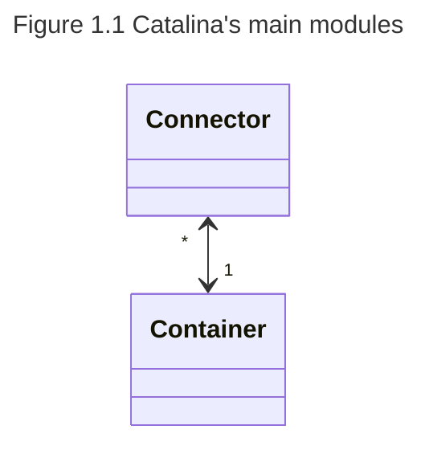

---
title： 介绍
---

## 概要

欢迎阅读《How Tomcat Works》这本书。这本书解剖了Tomcat4.1.12和5.0.18版本，解释了它的servlet容器的内部运行机制，那是一个免费的，开源的，最受欢迎的servlet容器，代号为Catalina。Tomcat是一个复杂的系统，由许多不同的组件构成。那些想要学习Tomcat运行机制的朋友大部分知道从何入手。这本书会提供一个蓝图，然后为每一个组件构造一个简化版本，使得可以更加容易的理解这些组件。在这之后才会对真实的组件进行解释。 你应该从这份简介开始阅读，因为它解释了这本书的结构，同时给你勾画了这个项目构造的简洁轮廓。“准备前提软件”这一节会给你一些指示，例如你需要下载什么样的软件，如何为你的代码创建目录结构等等。

## 本书为谁而作

这本书是为任何一个使用Java技术进行工作的人而准备的。

* 假如你是一个servlet/jsp程序员或者一个Tomcat用户，而且对一个servlet容器是如何工作这个问题你感兴趣的话，这本书就是为你准备的。
* 假如你想加入Tomcat的开发团队的话，这本书就是为你准备的，因为你首先需要学习那些已存在的代码是如何工作的。
* 假如你从未涉及web开发，但你对一般意义上的软件开发感兴趣的话，你可以在这本书学到一个像Tomcat一样的大型项目是如何进行设计和开发的。
* 假如你想配置和自定义Tomcat，你也应该读读这本书。

为了理解书中的讨论，你需要了解Java面向对象编程技术以及servlet编程。假如你对这些不熟悉的话，这里有很多书籍可以参考，包括Budi的《Java for the Web with Servlets, JSP, and EJB》。为了让这些材料更容易理解，每一章开始都会有便于理解所讨论主题的必要的背景资料介绍。

## Servlet容器是如何工作的

servlet容器是一个复杂的系统。不过，一个servlet容器要为一个servlet的请求提供服务，基本上有三件事要做:

* 创建一个request对象并填充那些有可能被所引用的servlet使用的信息，如参数、头部、cookies、查询字符串、URI等等。一个request对象是javax.servlet.ServletRequest或javax.servlet.http.ServletRequest接口的一个实例。
* 创建一个response对象，所引用的servlet使用它来给客户端发送响应。一个response对象javax.servlet.ServletResponse或javax.servlet.http.ServletResponse接口的一个实例。
*  调用servlet的service方法，并传入request和response对象。在这里servlet会从request对象取值，给response写值。

当你读这些章节的时候，你将会找到关于catalina servlet容器的详细讨论。

## Catalina架构图

Catalina是一个非常复杂的，并优雅的设计开发出来的软件，同时它也是模块化的。基于“Servlet容器是如何工作的”这一节中提到的任务，你可以把Catalina看成是由两个主要模块所组成的：连接器(connector)和容器(container)。在Figure I.1中的架构图，当然是简化了。在稍后的章节里边，你将会一个个的揭开所有更小的组件的神秘面纱。

现在重新回到Figure I.1，连接器是用来“连接”容器里边的请求的。它的工作是为接收到每一个HTTP请求构造一个`request`和`response`对象。然后它把流程传递给容器。容器从连接器接收到requset和response对象之后调用servlet的service方法用于响应。谨记，这个描述仅仅是冰山一角而已。这里容器做了相当多事情。例如，在它调用servlet的service方法之前，它必须加载这个servlet，验证用户(假如需要的话)，更新用户会话等等。一个容器为了处理这个进程使用了很多不同的模块，这也并不奇怪。例如，管理模块是用来处理用户会话，而加载器是用来加载servlet类等等。

### Tomcat 4和5

这本书涵盖了Tomcat4和5.这两者有一些不同之处:

* Tomcat 5支持Servlet 2.4和JSP 2.0规范，而Tomcat 4支持Servlet 2.3和JSP 1.2。
* 比起Tomcat 4，Tomcat 5有一些更有效率的默认连接器。
* Tomcat 5共享一个后台处理线程，而Tomcat 4的组件都有属于自己的后台处理线程。因此，就这一点而言，Tomcat 5消耗较少的资源。
*  Tomcat 5并不需要一个映射组件(mapper component)用于查找子组件，因此简化了代码。

## 各章概述

这本书共20章，其中前面两章作为导言。

第1章说明一个HTTP服务器是如何工作的，第2章突出介绍了一个简单的servlet容器。接下来的两章关注连接器，第5章到第20章涵盖容器里边的每一个组件。

以下是各章节的摘要。

> **注意**:对于每个章节，会有一个附带程序，类似于正在被解释的组件。 

第1章从这本书一开始就介绍了一个简单的HTTP服务器。要建立一个可工作的HTTP服务器，你需要知道在java.net包里边的2个类的内部运作：`Socket`和`ServerSocket`。这里有关于这2个类足够的背景资料，使得你能够理解附带程序是如何工作的。
第2章说明简单的servlet容器是如何工作的。这一章带有2个servlet容器应用，可以处理静态资源和简单的servlet请求。尤其是你将会学到如何创建request和response对象，然后把它们传递给被请求的servlet的service方法。在servlet容器里边还有一个servlet，你可以从一个web浏览器中调用它。

第3章介绍了一个简化版本的Tomcat 4默认连接器。这章里边的程序提供了一个学习工具，用于理解第4章里边的讨论的连接器。 

第4章介绍了Tomcat 4的默认连接器。这个连接器已经不推荐使用，推荐使用一个更快的连接器，Coyote。不过，默认的连接器更简单，更易于理解。 

第5章讨论container模块。container指的是`org.apache.catalina.Containe`r接口，有4种类型的container:`engine`, `host`, `context`和`wrapper`。这章提供了两个工作于context和wrapper的程序。 

第6章解释了Lifecycle接口。这个接口定义了一个Catalina组件的生命周期，并提供了一个优雅的方式，用来把在该组件发生的事件通知其他组件。另外，Lifecycle接口提供了一个优雅的机制，用于在Catalina通过单一的start/stop来启动和停止组件。

第7章包括日志，该组件是用来记录错误信息和其他信息的。

第8章解释了加载器(loader)。加载器是一个重要的Catalina模块，负责加载servlet和一个web应用所需的其他类。这章还展示了如何实现应用的重新加载。 

第9章讨论了管理器(manager)。这个组件用来管理会话管理中的会话信息。它解释了各式各样类型的管理器，管理器是如何把会话对象持久化的。在章末，你将会学到如何创建一个的应用，该应用使用`StandardManager`实例来运行一个使用会话对象进行储值的servlet。

 第10章包括web应用程序安全性的限制，用来限制进入某些内容。你将会学习与安全相关的实体，例如 主角(principals)，角色(roles)，登陆配置，认证等等。你也将会写两个程序，它们在`StandardContext`对象中安装一个身份验证阀(authenticator valve)并且使用了基本的认证来对用户进行认证。 

第11章详细解释了在一个web应用中代表一个servlet的`org.apache.catalina.core.StandardWrapper`类。特别的是，这章解释了过滤器(filter)和一个servlet的service方法是怎样给调用的。这章的附带程序使用`StandardWrapper`实例来代表servlet。 

第12章包括了在一个web应用中代表一个servlet的`org.apache.catalina.core.StandardContext`类。特别是这章讨论了一个`StandardContext`对象是如何给配置的，对于每个传入的HTTP请求在它里面会发生什么，是怎样支持自动重新加载的，还有就是，在一个在其相关的组件中执行定期任务的线程中，Tomcat 5是如何共享的。 

第13章介绍了另外两个容器：host和engine。你也同样可以找到这两个容器的标准实现:`org.apache.catalina.core.StandardHost`和`org.apache.catalina.core.StandardEngine`。 

第14章提供了服务器和服务组件的部分。服务器为整个servlet容器提供了一个优雅的启动和停止机制，而服务为容器和一个或多个连接器提供了一个支架。这章附带的程序说明了如何使用服务器和服务。 

第15章解释了通过Digester来配置web应用。Digester是来源于Apache软件基金会的一个令人振奋的开源项目。对那些尚未初步了解的人，这章通过一节略微介绍了Digester库以及XML文件中如何使用它来把节点转换为Java对象。然后解释了用来配置一个`StandardContext`实例的`ContextConfig`对象。 

第16章解释了shutdown钩子，Tomcat使用它总能获得一个机会用于clean-up，而无论用户是怎样停止它的(即适当的发送一个shutdown命令或者不适当的简单关闭控制台)。 

第17章讨论了通过批处理文件和shell脚本对Tomcat进行启动和停止。 

第18章介绍了部署工具(`deployer`)，这个组件是负责部署和安装web应用的。
第19章讨论了一个特殊的接口，`ContainerServlet`，能够让servlet访问Catalina的内部对象。特别是，它讨论了Manager应用，你可以通过它来部署应用程序。 第20章讨论了JMX以及Tomcat是如何通过为其内部对象创建MBeans使得这些对象可管理的。

## 各章的程序

每一章附带了一个或者多个程序，侧重于Catalina的一个特定的组件。通常你可以找到这些简化版本，无论是正在被解释的组件或者解释如何使用Catalina组件的代码。各章节的程序的所有的类和接口都放在ex[章节号].pyrmont包或者它的子包。例如第1章的程序的类就是放在ex01.pyrmont包中。

## 准备的前提软件

这本书附带的程序运行于J2SE1.4版本。压缩源文件可以从作者的网站www.brainysoftware.com中下载。它包括Tomcat 4.1.12和这本书所使用的程序的源代码。假设你已经安装了J2SE 1.4并且你的path环境变量中已经包括了JDK的安装目录，请按照下列步骤：

1. 解压缩ZIP文件。所有的解压缩文件将放在一个新的目录howtomcatworks中。howtomcatworks将是你的工作目录。在howtomcatworks目录下面将会有数个子目录，包括lib (包括所有所需的库)，src (包括所有的源文件)，webroot (包括一个HTML文件和三个servlet样本)，和webapps (包括示例应用程序)。

2. 改变目录到工作目录下并编译java文件。加入你使用的是Windows，运行`win-compile.bat`文件。假如你的计算机是Linux机器，敲入以下内容：(如有必要的话不用忘记使用`chmod ./linux-compile.sh` 注意：你可以在ZIP文件中的Readme.txt文件找到更多信息。